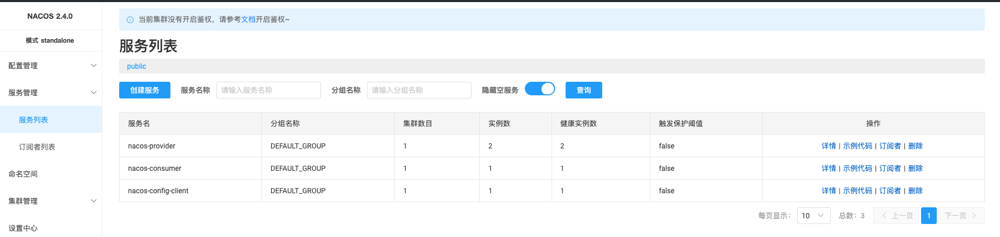
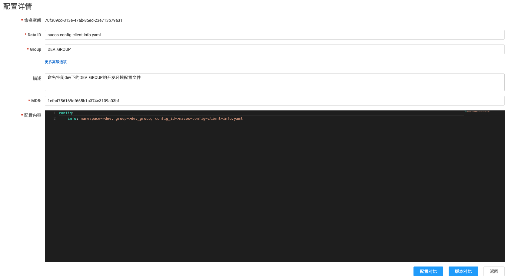
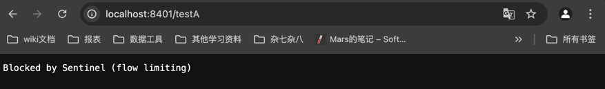
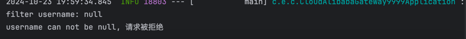
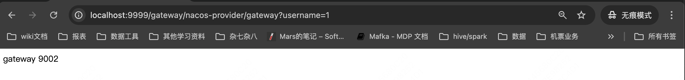

# 章节1.初始化微服务
2014年, Martin Fowler提出了微服务的概念, 定义为微服务是由单一应用程序构成的小服务, 自己拥有自己的进程与轻量化处理,
服务依业务功能设计, 以全自动的方式部署, 与其他服务使用HTTP API通信。同时服务会使用最小规模的集中管理能力, 服务可以用不同的编程语言与数据库组建实现。

### 架构的演变
随着互联网的发展, 网站应用的规模也在不断扩大, 进而导致系统架构也在不断的进行变化。从互联网早期到现在, 系统架构大概经历了下面几个过程:


##### 单体应用架构:
把所有的功能都集中在同一个应用中, 统一部署, 开发成本、部署成本和维护成本低。
- 优点: 项目架构简单, 适合用户量少的项目, 开发成本低, 把项目部署在一个节点上, 维护方便。
- 缺点: 功能集中在一个工程中, 项目模块紧耦合, 单点容错率低, 无法对不同的模块功能进行针对性的优化和水平扩展。

##### 垂直应用架构:
所谓垂直应用架构, 其实就是把之前的单体应用拆分成多个应用。比如电商系统可以拆分成: 电商系统, 后台管理系统, CMS系统
- 优点: 项目拆分实现了流量分担, 解决了并发问题, 并且可以针对不同子应用进行优化和水平拓展, 同时不同的系统之间不会互相影响, 容错率相比单体架构提高了
- 缺点: 系统之间无法互相调用, 系统之间是相互独立的, 会造成一部分功能的冗余。

##### 分布式架构:
随着业务的增加, 在垂直应用架构中冗余的业务代码越来越多, 此时就需要将冗余的业务代码抽取出来, 统一抽象成一个业务层来单独处理, 变成一个单独的服务。
控制层调用不同的业务层服务就能完成不同的业务功能。具体表现是一个项目拆分为表现层和服务层两个部分, 服务层中包含着业务逻辑, 表现层只负责处理和页面的交互。业务逻辑都是调用服务层的服务来实现的。这就是分布式架构
- 优点: 抽取公共的功能作为服务层, 提高代码的复用性
- 缺点: 服务间耦合度变高, 调用关系错综复杂, 难以维护。

##### SOA架构:
分布式架构中的缺点就是调用复杂, 并且当服务越来越多时, 或者当某一个服务压力过大时就需要水平拓展和负载均衡。对于资源调度和治理(解决服务间调用问题)就需要用到治理中心SOA(Service Oriented Architecture)来解决。
同时治理中心还可以帮助我们解决服务之间协议不同的问题。
- 优点: 使用治理中心(ESB/dubbo)解决了服务间调用关系的自动调节。
- 缺点: 服务间会有依赖关系, 一旦某个环节出错会影响较大(服务雪崩), 服务关系复杂, 运维、测试、部署困难。

##### 微服务架构:
微服务架构在某种程度上是SOA继续发展的下一步, 它更加强调服务的彻底拆分, 目的就是提高效率。微服务架构中, 每个服务可以独立部署切互不影响。微服务架构更加轻量级。
- 优点: 服务原子化拆分, 独立打包、部署和升级, 保证每个微服务有清晰的任务划分, 利于扩展
- 缺点: 分布式系统开发的技术成本高(容错, 分布式事务等), 复杂性更高

##### 微服务架构与SOA架构的不同
1. 微服务架构比SOA架构更加的精细, 让专业的人做专业的事。
2. SOA架构中可能会共享数据库存储。微服务架构强调每个服务都有自己的数据库, 服务之间互不影响。
3. 微服务项目架构比SOA架构更加适合互联网公司进行敏捷开发, 快速迭代版本, 因为服务粒度非常精细。

### Spring Cloud发展历史
##### Spring Cloud netflix -> Spring Cloud Alibaba
2019年,Spring Cloud宣布Spring Cloud netflix项目进入维护模式(不新增,只修复bug)。Spring Cloud Alibaba现在成为了主流。

##### Spring社区毕业
2019年7月24日, Spring官方宣布Spring Cloud Alibaba毕业, 仓库迁移至Alibaba Github OSS下。这意味着Spring Cloud Alibaba是国内首个进入Spring社区的开源项目。

这是Spring Cloud Alibaba提供的feature:
- 服务限流降级: 使用Sentinel进行流量控制, 熔断降级以及系统保护等。
- 服务注册与发现: 使用Nacos适配Spring Cloud服务注册与发现标准, 默认集成了Ribbon这个客户端负载均衡组件。
- 分布式配置管理: 以Nacos作为数据存储支持分布式系统中的外部化配置, 配置更改时自动刷新。
- 事件驱动: 使用Spring Cloud Stream RocketMQ Binder来构建事件驱动的微服务实例。
- 消息总线: 使用Spring Cloud Bus RocketMQ 连接分布式系统中的各个节点。
- 分布式事务: 使用Seata高效且对业务零入侵的解决分布式事务问题。
- Dubbo RPC: 扩展Spring Cloud服务调用协议, 可使用Spring Cloud客户端调用Dubbo服务。
- 阿里云OSS集成: 使用阿里云OSS服务集成Spring Resource资源。(Object Storage Service, 对象存储服务, 和亚马逊的S3类似)

### Spring Cloud Alibaba
Spring Cloud Alibaba致力于提供微服务开发的一站式解决方案, 此项目包含开发分布式应用微服务的必需组件, 方便开发者通过Spring Cloud编程模型来轻松的使用这些组件开发分布式应用服务。

依托Spring Cloud Alibaba, 我们只需要添加一些注解和少量配置, 就可以将Spring Cloud应用接入阿里微服务解决方案, 通过阿里中间件来迅速搭建分布式应用系统。

### 主要功能


### 组件


# 章节2 Spring Cloud Alibaba Nacos 下载和安装
## Nacos介绍
Nacos (Naming Configuration Service) 是一个易于使用的动态服务发现、配置和服务管理平台, 用于构建云原生应用程序。<br/>
**服务发现是微服务架构中的关键组件之一。** Nacos致力于帮我们发现、配置和管理微服务。Nacos提供了一组简单易用的特性集, 帮我们快速实现动态服务发现、服务配置、服务元数据以及流量管理。

Nacos帮我们更敏捷和容易的构建、交付和管理微服务平台, Nacos是构建以"服务"为中心的现代应用架构(例如微服务范式, 云原生范式)的服务基础设施。

## 什么是Nacos?
1. Nacos = **注册中心+配置中心组合**
2. Nacos支持几乎所有主流类型的 服务 的发现、配置和管理, 常见的服务如下:
- Kubernetes Service
- gPRC & Dubbo RPC Service
- Spring Cloud Restful Service

## 为什么要使用Nacos?
为什么要使用注册中心? <br/>
举一个入住酒店的例子, 如果一个没有服务前台的酒店, 客人需要自己寻找合适居住的房间。但是客人不知道每个房间的情况, 无法确定哪个房间是打扫干净可以入住的, 只能逐个房间去找, 这是不好的 <br/>
正常的情况是酒店会安排服务台, 酒店打扫干净可以入住的房间会登记注册到服务台, 这样客人来住酒店, 只需要到前台就可以查到可以入住的酒店。 <br/>
显然, 服务器提供发现注册机制可以让房客快速找到合适的房间, 快速解决入住问题。 (客人->请求, 房间->服务, 前台->Nacos)

采用微服务之后, 软件微服务组件各自独立, 但是最终还是要作为一个整体/软件系统服务于用户。这是软件组件之间也需要彼此通讯, 彼此调用方法。 <br/>
微服务架构内部发起调用方法的一方称为 "**服务消费者**", 提供远程方法调用的服务器称为 "服务提供者"。 <br/>
往往为了提高系统性能, 会使用多个服务器作为**服务提供者**, 此时**服务消费者**找到**服务提供者的过程**, 就类似于用户找房间的过程。<br/>
为了帮助**服务消费者**快速的发现**服务提供者**, 在微服务框架中都会引入**注册中心**。**注册中心**类似于酒店的前台, 提供软件服务的注册和发现功能。<br/>
**服务提供者**会现在注册中心进行**注册**, 声明可以对外提供服务, 而**服务消费者**只需要在注册中心就可以快速**发现**可以使用的服务。 <br/>
注册中心实现了服务提供和服务消费的快速整合功能。


## Nacos下载和安装
官网网址: https://nacos.io

Nacos官方文档: https://nacos.io/docs/latest/what-is-nacos/

Nacos下载地址: https://github.com/alibaba/nacos/releases (这里我们下载最新的稳定版本 nacos 2.4.0.1, /opt/nacos)


linux/unix/mac:启动命令(standalone代表单机模式运行):
```bash
sh startup.sh -m standalone
```
启动nacos后可访问localhost:8848/nacos来测试nacos是否起启动成功

ps:低版本nacos有登陆页, 用户名/密码都是nacos

# 章节3 Nacos服务提供者注册
### Nacos代替Eureka
Nacos可以直接提供注册中心(Eureka) + 配置中心(config), 它比Eureka更加方便, 不需要我们自己再做配置。

### Nacos服务注册中心
服务发现是微服务架构中的关键组件之一。在这样的架构中, 手动为每一个客户端配置服务列表是一项艰巨的任务, 并且使得扩展极其困难。<br/>
Nacos Discovery会帮助我们将服务自动注册到Nacos服务器, Nacos服务器会跟踪服务并动态刷新服务列表。<br/>
此外, Nacos Discovery会将服务实例的一些元数据, 如主机、端口、健康检查URL、主页等注册到Nacos。

spring-cloud官方文档: https://spring.io/projects/spring-cloud-alibaba#learn

### 如何引入Nacos Discovery进行服务注册/发现
##### 创建新项目:
聚合项目: 聚合项目在SpringBoot中广泛采用, 开发中将SpringBoot项目按照功能分成子模块进行开发, 所以我们在使用Spring Cloud Alibaba完成项目的时候, 也是使用聚合项目来完成。

##### 创建子模块:
cloudAlibaba-nacos-9001

##### 修改子模块的pom文件:
/Users/zhaoyu/Desktop/SpringCloud/cloudAlibaba-nacos-9001/pom.xml


##### 父项目中添加子模块:


##### 配置yaml文件
子项目cloudAlibaba-nacos-9001中: /Users/zhaoyu/Desktop/SpringCloud/cloudAlibaba-nacos-9001/src/main/resources/application.yaml
```shell
server:
   port: 9001
spring:
  application:
    name: nacos-provider-9001
  cloud:
    nacos:
      discovery:
        server-addr: localhost:8848

```
##### 启动类添加注解
@EnableDiscoveryClient
```java
@SpringBootApplication
@EnableDiscoveryClient
public class CloudAlibabaNacos9001Application {

    public static void main(String[] args) {
        SpringApplication.run(CloudAlibabaNacos9001Application.class, args);
    }
}

```

接口测试:src/main/java/com/example/cloudalibabanacos9001/controller/DemoController.java

##### 测试服务是否注册
启动服务, 到nacos: localhost:8848中查看注册到nacos上的服务


访问http://localhost:9001/demo 服务接口也是通的

ps:[springboot与spring cloud alibaba的版本对应关系](https://sca.aliyun.com/blog/faq/sca-user-question-history14747/?source=wuyi) 二者版本不兼容的话, 会导致有些bean加载不到(新版本中没有这些bean了)

##### 练习: 创建9002服务提供者 ✅
同时启动9001服务和9002服务:


# 章节4 Nacos服务消费者注册与负载均衡
### 新建消费者Module
创建cloud-Alibaba-nacos-consumer-1模块, 依旧引入nacos-discovery依赖:

```xml
        <dependency>
            <groupId>com.alibaba.cloud</groupId>
            <artifactId>spring-cloud-starter-alibaba-nacos-discovery</artifactId>
        </dependency>
        <dependency>
            <groupId>org.springframework.cloud</groupId>
            <artifactId>spring-cloud-starter-loadbalancer</artifactId>
            <version>3.1.0</version>
        </dependency>
```

ps:spring-cloud-starter-loadbalancer, SpringCloud御用负载均衡组件LoadBalancer, 用来代替已经进入维护状态的Netflix Ribbon组件。不配置的话在请求服务负载均衡时会报错UnknownHostException.

[Spring Cloud Alibaba 服务消费者调用 nacos 服务报错：java.net.UnknownHostException: xxx](https://blog.csdn.net/qq_42971035/article/details/124822337)

启动类上还是加@EnableDiscoveryClient注解:

```java
@SpringBootApplication
@EnableDiscoveryClient
public class CloudAlibabaNacosConsumer1Application {

    public static void main(String[] args) {
        SpringApplication.run(CloudAlibabaNacosConsumer1Application.class, args);
    }

}
```


### 远程调用Ribbon
此时可能我们还是很困惑, 服务消费者不是要去调用具体服务吗? 但是现在仅仅是创建出来了, 和之前创建的服务提供者除了spring.application.name不同, 也没什么区别

其实, 如果我们想要让服务的消费者去调用服务提供者, 就需要通过Ribbon来调用, 首先让我们来了解Ribbon

##### 什么是Ribbon
Ribbon是一个基于HTTP和TCP的客户端负载均衡器。它虽然只是一个工具类库, 却是每一个微服务的基础设置。因为实际上, 对于服务间调用、API网关请求转发都需要经过Ribbon负载均衡来实现。 <br/>
总体来说, Ribbon的主要作用是: 从注册服务器拿到对应的服务列表后以负载均衡的方式访问对应服务。

什么时候应该使用Ribbon? 当一个模块需要从另一个模块获取数据的时候, 就需要使用Ribbon的远程访问功能了

要注意的是, Nacos已经整合了Ribbon, 所以我们想要使用Ribbon的话只需要导入Spring Cloud Alibaba Nacos依赖就可以了。<br/>
ps:一个服务应用提供服务的机器肯定不止一台, 是一个集群, 这里我们是用两个服务来模拟一个服务两台机器的集群(Ribbon按照一定策略来调用服务)。


##### 具体使用
RestTemplate封装了Ribbon调用的过程, 其中getForObject是最常用的方法, 我们还需要在服务消费者中配置RestTemplate:

````java
@Bean
@LoadBalanced
public RestTemplate restTemplate(){
    return new RestTemplate();
}

restTemplate.getForObject(arg1, arg2, arg3...)
````

- arg1: 表示被调用的目标Rest接口位置。
- - 1. url的第一部分是在Nacos中注册的服务提供者名称, 如果多个服务提供者注册的是相同名称, Ribbon寻找其中一个服务提供者并调用其接口方法。
- - 2. url后半部分是控制器的请求路径

- arg2: 返回值类型
- - 1. javaBean类型或者javaBean数组类型, 如果控制器返回的是List集合, 需要使用数组类型接收

- arg3...: 可变参数
- - 1. 传递给url的动态参数, 使用参数时需要在url上使用{1},{2},{3}...进行占位, 传递的参数会自动替换占位符

接下来我们需要通过服务消费者访问服务提供者, 在这之前, 我们先要修改一下consumer-nacos的yaml文件:

```xml
server:
  port: 8081
spring:
  application:
    name: nacos-consumer
  cloud:
    nacos:
      discovery:
        server-addr: localhost:8848
        service: http://nacos-provider
```
这里实际访问时 nacos-provider会被替换为服务的真正ip地址

配置RestTemplate实例 /Users/zhaoyu/Desktop/SpringCloud/cloud-Alibaba-nacos-consumer-1/src/main/java/com/example/cloudalibabanacosconsumer1/bean/RestTemplateConfig.java

```java
@Configuration
public class RestTemplateConfig {
    @Bean
    @LoadBalanced
    public RestTemplate restTemplate(){
        return new RestTemplate();
    }
}
```
在消费者上通过Ribbon调用服务提供者:

```java
@RestController
public class DemoController {
    @Autowired
    private RestTemplate restTemplate;

    @Autowired
    private DiscoveryClient discoveryClient;

    @GetMapping("/consumer1")
    public String getDiscovery(){
        List<ServiceInstance> instances = discoveryClient.getInstances("nacos-provider");
        for (ServiceInstance serviceInstance : instances){
            System.out.println(serviceInstance.getHost()); //172.18.141.186
            System.out.println(serviceInstance.getPort()); //9001,9002
        }

        return restTemplate.getForObject("http://nacos-provider/demo/", String.class);
    }
}
```
负载均衡效果:


# 章节5 Nacos服务注册中心对比
### 各种服务注册中心对比
| 服务注册与发现框架 | CAP模型 | 控制台管理 | 社区活跃度      |
|-----------|-------|-------|------------|
| Eureka    | AP    | 支持    | 低(2.x版本闭源) |
| Zookeeper | CP    | 不支持   | 中          |
| Consul    | CP    | 支持    | 高          |
| Nacos     | AP/CP | 支持    | 高          |

### CAP模型
- 一致性(Consistency): 同一时刻的同一请求的实例返回的结果相同, 所有的数据要求具有强一致性
- 可用性(Availability): 所有实例的读写请求在一定时间内可以得到正确的响应
- 分区容错性(Partition tolerance): 在部分节点网络异常(光缆断裂、设备宕机)的情况下, 系统仍能提供正常的服务

以上三个特性就是CAP原则(又称CAP定理), 但是三个特性是不可能同时满足的, 所以分布式系统设计要考虑的是在满足P(分区容错性)的前提下选择C(一致性)还是A(可用性), 即在CP或AP之间做取舍

### CP原则: 一致性 + 分区容错性原则
CP原则属于强一致性原则, 要求所有节点可以查询的数据随时要保持一致(节点间正在同步的数据不可查询)。<br/> 
即:若干个节点形成一个逻辑的共享区域, 某一个节点更新的数据都会立即同步到其他数据节点中,当数据同步完成后才能返回成功的结果。 <br/>
但是在实际的运行过程中网络故障在所难免, 如果此时若干个服务节点之间无法通讯(同步数据时), 集群就不能对外提供服务, 牺牲了可用性原则(A)。<br/>
例如关系型数据库中的事务。 
宁可什么都不做也不能做错

### AP原则: 可用性原则 + 分区容错性原则
AP原则属于弱一致性原则, 在集群中只要有存活的节点那么发送来的所有请求都可以得到响应。在进行数据同步处理的操作中(eg:主从复制), 即使某些节点没有成功的实现数据同步, 也不会影响系统正常的提供服务, 但是这样会牺牲一致性原则(存活机器和宕机机器的数据不一致) <br/>
事实上, 在宕机机器恢复后, 会尝试重新从主机拉取最新数据, 但是在这个时间段内 主从的数据还是不一致的。

宁可做错也不能什么都不做

### Nacos支持CP和AP
Nacos无缝支持一些主流的开源生态, 同时在阿里设计Nacos的时候考虑到了市面上的不同框架(市面上的框架大多都是单一的实现为主, eg: zookeeper:CP), 在Nacos中提供了AP/CP两种模式的切换。

### Nacos什么时候要切换模式
1. 一般来说, 如果不需要存储服务级别的信息并且服务实例是通过nacos-client注册, 并能够保持心跳上报, 就可以选择AP模式。如Spring Cloud和Dubbo, 都适用于AP模式。<br/>
AP模式为了服务的可用性减弱了一致性, 因此AP模式下只支持注册临时实例。 
2. 如果需要在服务级别编辑或者储存配置信息, 那么必须使用CP, k8s服务和DNS服务则适用于CP模式。<br/> 
CP模式下支持注册持久化实例, 此时是以Raft协议为集群运行模式, 该模式下注册实例之前必须先注册服务, 如果服务不存在 会返回错误。
3. 切换CP命令(默认是AP):
```bash
curl -X PUT '$NACOS_SERVER:8848/nacos/v1/ns/operator/switches?entry=serverMode&value=CP'
```

注意: 临时实例和持久化实例的区别主要在健康检查失败后的表现, 持久化实例(CP)健康检查失败后会被标记为不健康, 而临时实例(AP)会直接从列表中被删除。

# 章节6 Nacos之服务配置中心 (加载远程配置文件)
Nacos不仅可以作为注册中心来使用, 同时它支持作为配置中心


我们创建一个新的模块: cloudAlibaba-config来进行nacos服务配置中心的练习

导入maven依赖:
```xml
 <dependencies>
    <dependency>
        <groupId>org.springframework.boot</groupId>
        <artifactId>spring-boot-starter-web</artifactId>
    </dependency>
    <!--ncaos配置中心依赖-->
    <dependency>
        <groupId>com.alibaba.cloud</groupId>
        <artifactId>spring-cloud-starter-alibaba-nacos-config</artifactId>
    </dependency>
    <!--ncaos服务中心依赖-->
    <dependency>
        <groupId>com.alibaba.cloud</groupId>
        <artifactId>spring-cloud-starter-alibaba-nacos-discovery</artifactId>
    </dependency>

    <dependency>
        <groupId>org.springframework.boot</groupId>
        <artifactId>spring-boot-starter-test</artifactId>
        <scope>test</scope>
    </dependency>
    <dependency>
        <groupId>org.springframework.cloud</groupId>
        <artifactId>spring-cloud-starter-bootstrap</artifactId>
        <version>3.0.3</version>
    </dependency>
</dependencies>
```

我们需要配置两个配置文件: bootstrap.yaml和application.yaml <br/>
其中bootstrap.yaml的优先级比application.yaml的优先级高, bootstrap.yaml的作用是:
1. 加载3377服务到Nacos中
2. 去Nacos中读取指定配置文件

bootstrap.yaml:
```xml
# ncaos配置
server:
  port: 3377

spring:
  application:
    name: nacos-config-client
  cloud:
    nacos:
      discovery:
        server-addr: localhost:8488 # Nacos服务注册中心地址
      config:
        server-addr: localhost:8488 # Nacos配置中心地址
        file-extension: yaml # 指定加载yaml后缀的配置文件
```

application.yaml:
```xml
spring:
  profiles:
    active: test # 表示测试环境
```

主启动类:
```java
@SpringBootApplication
@EnableDiscoveryClient
public class CloudAlibabaConfig3377Application {
    public static void main(String[] args) {
        SpringApplication.run(CloudAlibabaConfig3377Application.class, args);
    }
}
```

业务类: <br/>
这里的@RefreshScope实现的是配置自动更新, 意思是如果想要使nacos配置文件中的配置修改后不用重启项目即生效, 可以使用@RefreshScope来实现
```java
@RestController
@RefreshScope // 支持从Nacos的动态刷新功能
public class ConfigClientController {
    @Value("${config.info}")
    private String configInfo;

    @RequestMapping("/config/info")
    public String getConfigInfo(){
        return configInfo;
    }
}
```

ps: 即使类中没有setter方法, 我们也能通过反射来给对象设置属性值:


### Nacos配置规则
在Nacos Spring Cloud中, dataId的完整格式如下: (详情可以参考官网 https://nacos.io/zh-cn/docs/quick-start-spring-cloud.html)

> ${prefix}-${spring.profiles.active}.${file-extension}

> 1. `prefix` 默认为`spring.application.name`的值, 也可以通过配置项 `spring.cloud.nacos.config.prefix` 来配置。
> 2. `spring.profiles.active` 即为 当前环境对应的 `profile 配置文件`。注意: 当 `spring.profiles.active` 为空时, 对应的连接符 `-` 也将不存在, dataId的拼接格式变为 `${prefix}.${file-extension}`
> 3. `file-extension` 为配置内容的数据格式, 可以通过配置项 `spring.cloud.nacos.file-extention` 配置项来配置, 目前只支持 `properties` 和 `yaml` 类型
> 4. 通过 Spring Cloud 的原生注解 `@RefreshScope` 来实现nacos配置的自动更新
> 5. 举例: 最终需要在Nacos配置中心添加的配置文件的名字为 `nacos-config-client-test.yaml`, 即 `微服务名称-当前服务环境-文件格式`


ps: 测试配置中心服务启动时, 报错 No spring.config.import property has been defined问题: https://blog.csdn.net/zhiyikeji/article/details/119855619

启动服务, 测试配置信息是否获取成功:




服务注册成功, 远程配置信息获取成功, 如果我们更改远程配置的话 因为@RefreshScope注解 我们不需要重启服务 也能获得最新的远程配置信息。

# 章节7. Nacos命名空间分组和DataID三者关系
### 名词解释
##### 命名空间 (Namespace)
用于进行租户粒度的配置隔离。不同的命名空间下, 可以存在相同的group或Data ID的配置, 默认是public。Namespace的常用场景之一是不同环境的配置的隔离, 例如开发环境、测试环境的资源(配置、服务)的隔离


##### 配置分组 (Group)
Nacos中的一组配置集, 是组织配置的维度之一。通过一个有意义的字符串对配置集进行分组, 从而区分Data ID相同的配置集。 <br/>
当我们在Nacos上创建一个配置时, 如果未填写配置分组的名称, 则默认的配置分组名称是DEFAULT_GROUP, 配置分组的常见场景: 不同的应用或组件使用了相同的配置类型, 如database_rul配置和MQ_topic配置

##### 配置集ID (Data ID)
Nacos中的某个配置集的ID, 配置集ID是组织划分配置的维度之一。Data ID通常用于组织划分系统的配置集。一个系统或者应用可以包含多个配置集, 每个配置集都可以有一个有意义的名称标识。 <br/>
Data ID通常采用类java包 (如 com.taobao.tc.refund.log.level)的命名规则保证全局唯一性。

配置集: 一组相关或者不相关的配置项的集合成为配置集。**在系统中, 一个配置文件通常就是一个配置集, 包含了系统各个方面的配置。** 例如: 一个配置集可能包含了数据源、线程池、日志级别等配置项。


### 命名空间(namespace), 配置分组(group), 配置集ID(Data ID)三者关系
这三者的关系类似于Java里面的package名和类名。最外层的Namespace是可以用来区分部署环境的, Group和DataID分别类似包和类。


##### 默认情况
Namespace=public, Group=DEFAULT_GROUP, Cluster=DEFAULT

##### 具体情况
Nacos默认的命名空间是public, 我们就可以利用Namespace来实现环境隔离, 比如我们现在有3个环境: 开发、测试、生产环境。我们就可以创建3个Namespace来隔离这三个环境。

Group本身就是分组的意思, 它可以把不同的微服务划分到同一个分组里面去。

剩下的就是具体微服务, 一个Service可以包含多个Cluster, Nacos默认Cluster是DEFAULT, Cluster是对微服务的一个虚拟划分。 <br/>
比如说, 将一个Service部署在北京和上海的机房中, 北京机房的Service就可以起名为BJ, 上海机房的Service就可以起名为SH, 这样就可以尽量让同一个机房的微服务相互调用, 提升性能。

### 切换不同环境
##### 1.DataID方案
a. 指定spring.profile.active和配置文件的DataID来实现不同环境下读取不同的配置, 配置规则:默认空间+新建dev和test两个DataID:
1. 新建dev配置DataID
2. 新建test配置DataID

项目: cloudAlibaba-config-3377


b. 修改application.yaml
```xml
spring:
  profiles:
    active: test # 表示测试环境
    # active: dev 表示开发环境
```
c. 测试服务的接口


测试成功, dev环境下的服务读到了dev配置文件。

##### 2.Group方案
根据之前的讲解我们知道了nacos中Group的默认分组是: DEFAULT_GROUP, 所以我们现在就要分为两组, 一组是`Dev开发组`, 一组是`Test测试组`

1. nacos上新建Group

新建DEV_GROUP


新建TEST_GROUP


2. 完成以上配置后, 接下来需要修改bootstrap和application配置文件。具体方式: 在config下增加一条Group的配置即可:

bootstrap.yaml:

```xml
# ncaos配置
server:
  port: 3377

spring:
  application:
    name: nacos-config-client
  cloud:
    nacos:
      discovery:
        server-addr: localhost:8848 # Nacos服务注册中心地址
      config:
        server-addr: localhost:8848 # Nacos配置中心地址
        file-extension: yaml # 指定加载yaml后缀的配置文件
        group: TEST_GROUP # 指定服务所在的分组
```

application.yaml:

```xml
spring:
  profiles:
    active: info 
    # test 表示测试环境
    # active: dev 表示开发环境
```

3. 测试接口


服务确实在TEST_GROUP下, 读取到了TEST_GROUP下的nacos-config-client-info.yaml配置文件

##### 3. Namespace方案
接下来我们看一下Namespace (命名空间)方案, nacos的namespace默认为public, 此方案不能被修改/删除, 我们现在来新建两个命名空间方案。

1. 新建命名空间


自动生成的命名空间ID很重要, 后续我们会根据这个ID来做环境的切换

此时服务列表/配置列表这里也出现了我们创建的dev/test命名空间:


2. 修改配置文件 

修改bootstrap.yaml文件, 切换命名空间:
```xml
# ncaos配置
server:
  port: 3377

spring:
  application:
    name: nacos-config-client
  cloud:
    nacos:
      discovery:
        server-addr: localhost:8848 # Nacos服务注册中心地址
      config:
        server-addr: localhost:8848 # Nacos配置中心地址
        file-extension: yaml # 指定加载yaml后缀的配置文件
        group: DEV_GROUP # 指定服务所在的分组 TEST_GROUP or DEV_GROUP
        namespace: 70f309cd-313e-47ab-85ed-23e713b79a31 # 指定服务在哪个命名空间下面
```
在dev命名空间下准备配置文件:



3. 测试接口


测试接口成功, 服务确实加载了`dev命名空间`, `dev-group分组`, `nacos-config-client-info.yaml`配置文件

# 章节8. Nacos集群架构说明
目前为止我们已经对nacos的一些基本使用和配置有了了解, 但是这还是不够的 我们还需要了解一个非常重要的点，就是Nacos集群相关的操作。

### Nacos支持三种部署模式
1. 单机模式: 用于测试和单机使用
2. 集群模式: 用于生产环境, 确保高可用
3. 多集群模式: 用于多数据中心场景


默认Nacos使用了嵌入式数据库实现数据的持久化存储。但是, 如果我们启动多个默认配置下的nacos节点, 就会存在数据一致性问题。为了解决这个问题, nacos采用了集中存储方式来支持集群化部署, **目前仅支持Mysql的存储**。

##### 单机模式支持mysql
nacos默认的内嵌数据库 不方便我们观察数据存储的基本情况。nacos 0.7版本以后增加了对mysql的支持, 具体的操作步骤:
1. 安装mysql数据库, 版本要求: 5.6.5+
2. 初始化mysql数据库, 数据库初始化文件: nacos-mysql.sql
3. 修改 conf/application.properties文件, 增加mysql的数据源配置信息(ip,port,用户名,密码)

# 章节9. Nacos持久化配置
Nacos默认自带嵌入式数据库derby, 所以我们每次创建一个Nacos实例的时候就会有一个derby实例。当有多个Nacos节点的时候 就会出现一致性问题, 所以Nacos支持了Mysql作为外部数据库来统一管理持久化数据。

##### 1. 执行mysql数据库初始脚本
创建数据库 nacos_config

执行mysql-schema.sql脚本

##### 2.修改conf/application.properties文件
```xml
######################## mysql #####################
spring.datasource.platform=mysql

db.num=1
db.url.0=jdbc:mysql://127.0.0.1:3306/nacos_config?allowPublicKeyRetrieval=true&c
haracterEncoding=utf8&connectionTimeout=1000&socketTimeout=3000&autoReconnect=tr
ue&serverTimezone=UTC
db.user=root
db.password=199741zy
```

##### 3.测试
重启nacos服务, 此时之前创建的namespace + group + dataId 将全部消失, 因为这些数据之前是保存在derby中的, 而现在我们使用的是mysql数据库。

重启Nacos服务, 使得配置生效
```shell
sh shutdown.sh

sh startup.sh -m standalone
```
此时我们nacos页面上的配置和命名空间、分组信息都没了:


新建一个配置文件:


查询mysql数据库中的config_info表的数据:
```sql
select
*
from 
config_info;
```
可以查询到刚刚的配置信息

# 章节10. Nacos之linux版本安装

# 章节11. Nacos集群配置1
1. 更改Nacos的内置数据库 -> mysql, 准备mysql环境
2. 修改cluster.conf配置文件
在cluster.conf中输入nacos节点的ip地址和端口号

ps: 修改nacos服务监听的端口号 修改conf/application.properties文件中的server.port属性

ps: 如果想在本机启动3个nacos实例来模拟集群的话, 注意端口号的配置。nacos除了监听端口(默认8848)外, 默认还会占用监听端口+1000 以及 监听端口+1001 来进行nacos实例间的grpc通信, 因此我们配置端口时要注意别配置到了被占用的端口上了

3. 启动nacos (nacos默认的启动方式就是集群模式)
```shell
sh startup.sh
```
ps: 为了nacos节点之间能正常通信, 可能需要关闭防火墙

```shell
// 关闭防火墙服务, 开机会重启
systemctl stop firewalld

// 彻底关闭防火墙服务, 开机不会重启
systemctl disable firewalld
```
4. 测试
此时我们就可以访问各个节点下的nacos服务了: ip:port/nacos

集群模式启动nacos服务后, 在nacos页面上也能监控到集群中的节点


现在我们有了nacos集群, 接下来还需要配置nginx, 来让请求能够负载均衡的访问nacos服务

# 章节12. Nacos集群配置2
### Nginx配置
修改 conf/nginx.conf, 设置upstream为nacos的节点ip端口号

启动nginx
```shell
sbin/nginx
```
### 测试
访问nginx的ip:端口/${proxy_pass} 就可以看到ncaos的页面了

### 本地配置文件修改
现在因为我们的服务和nacos集群之间还隔了一层nginx代理, 所以我们需要把nacos的地址改为nginx地址, bootstrap.yaml:
```xml
# ncaos配置
server:
  port: 3377

spring:
  application:
    name: nacos-config-client
  cloud:
    nacos:
      discovery:
        server-addr: nginx地址
        # server-addr: localhost:8848 # Nacos服务注册中心地址
      config:
        server-addr: nginx地址
        # server-addr: localhost:8848 # Nacos配置中心地址
        file-extension: yaml # 指定加载yaml后缀的配置文件
        group: DEV_GROUP # 指定服务所在的分组 TEST_GROUP or DEV_GROUP
        namespace: 70f309cd-313e-47ab-85ed-23e713b79a31 # 指定服务在哪个命名空间下面
```

# 章节13. Nacos源码开篇
### 看源码的方法
1. 先使用
2. 关注核心功能
3. 总结归纳

### Nacos服务注册与发现 源码剖析
##### Nacos核心功能点
**服务注册:** Nacos Client会通过发送REST请求的方式向Nacos Server注册自己的服务, 提供自己的元数据 比如ip地址、端口等信息。Nacos Server接收到注册请求后, 就会把这些元数据信息存储在一个双层的内存Map中。

**服务心跳:** 在服务注册后, Nacos Client会维护一个定时心跳来持续通知Nacos Server, 说明服务一直处于可用状态 防止被剔除。 默认5s发送一次心跳。

**服务健康检查:** Nacos Server会开启一个定时任务用来检查注册服务实例的健康情况, 对于超过15s没有收到客户端心跳的实例 将会在把它的healthy属性置为false。如果某个实例超过30s没有收到心跳, 直接剔除该实例(被剔除的实例如果恢复心跳 则会重新注册服务)

**服务发现:** 服务消费者(Nacos Client)在调用服务提供者的服务时, 会发送一个REST请求到Nacos Server, 获取上面注册的服务清单, 并且缓存在Nacos Client本地, 同时会在Nacos Client本地开启一个定时任务 定时拉取服务端最新的注册表信息更新到本地缓存

**服务同步:** Nacos Server集群之前会互相同步服务实例信息, 用来保证服务信息的一致性

Nacos服务端原理:


Nacos客户端原理:


### Nacos源码下载
从github上clone nacos源码

nacos的项目入口: nacos-console/Nacos

nacos项目模块:


# 章节14. Nacos服务注册和NamingService接口
NamingService接口: Nacos客户端通过该接口向Nacos Server注册服务, 订阅服务, 取消订阅服务, 查询服务列表, 查询服务详情等功能。

实现类: com.alibaba.nacos.client.naming.NacosNamingService

创建客户端实例Instance(实例中存了客户端的配置信息) -> 通过NamingFactory获取NamingService实例 -> 通过NamingService实例注册服务实例Instance  // -> 通过NamingService提供的接口注册/订阅/取消订阅服务...

# 章节15. NacosNamingService实例注册源码分析
### 总结流程:


# 章节16. Nacos客户端服务实例注册源码分析


# 章节17. Nacos服务端服务实例注册源码分析

# 章节18. Nacos服务端健康检查

# 章节19. Nacos客户端服务发现源码分析

# 章节20. Nacos客户端服务订阅机制的核心流程

# 章节24. Sentinel介绍
### 什么是Sentinel
Sentinel是阿里开源的**分布式系统的流量防卫兵**。随着微服务的普及, 服务调用的稳定性变得越来越重要。 <br/>
Sentinel以流量为切入点, 在流量控制、断路、负载保护等多个领域开展工作, 保障服务的可靠性。

##### Sentinel的特点:
1. 丰富的应用场景: Sentinel承接了阿里近10年的双十一大促流量的核心场景, 如秒杀(将瞬时流量控制在系统容量可以承接的范围内), 消息削峰填谷, 集群流量控制, 实时熔断下游不可用应用等。
2. 完备的实时监控: Sentinel同时提供实时的监控功能, 我们可以在控制台中看到接入应用的单台机器的秒级数据, 甚至500台以下规模的集群的汇总运行情况。
3. 广泛的开源生态: Sentinel提供开箱即用的与其他开源框架/库的整合模块, 例如与Spring Cloud、 Apache Dubbo、grpc、Quarkus的整合。我们只需要引入依赖并进行简单配置即可快速接入Sentinel。同时Sentinel提供java/go/c++等多语言的原生实现。
4. 完善的spi扩展机制:Sentinel提供简单易用、完善的SPI扩展接口, 我们可以通过实现扩展接口来快速的定制逻辑, 例如实现规则管理、适配动态数据源等。

Sentinel官方文档: https://github.com/alibaba/Sentinel/wiki/介绍

##### 服务雪崩
多个微服务之间调用的时候, 假设A调用B和C, B和C又调用其他的微服务, 这就是所谓的扇出(下游模块依赖结构复杂, 越下层依赖越多 像一个扇子)。 <br/>
如果扇出的某个链路上的某个微服务不可用了, 微服务A的调用就会占用越来越多的系统资源, 从而放大微服务的不可用, 造成整个系统崩溃, 这就是服务雪崩。

要解决服务雪崩问题 就需要用到服务降级, 需要保证在一个依赖出现问题的情况下, 将故障服务隔离开 不要导致整体服务失败, 避免级联故障, 提高分布式系统的弹性.

服务雪崩: [什么是服务雪崩&如何解决服务雪崩](https://blog.csdn.net/llg___/article/details/131713367)

##### Sentinel的熔断降级通过断路器实现
断路器是一种开关装置, 当某个服务单元发生故障之后, 通过断路器的故障监控(类似于熔断保险丝), 向调用方返回一个符合预期的、可处理的备选响应(fallback),而不是长时间的等待或者抛出调用方无法处理的异常。 <br/>
这样就保证了服务调用方不会被长时间、不必要的等待拖累, 从而避免了故障在分布式系统中蔓延, 乃至雪崩。

##### Sentinel相比其他产品的优势
对比其他产品 比如Hystrix来说, Sentinel不需要我们手动搭建监控平台, 它有一套类似于nacos的web界面, 可以让我们进行更细粒度的配置流控、速率、服务熔断、服务降级等。


### Sentinel的下载和安装
下载地址: https://github.com/alibaba/Sentinel/releases

##### Sentinel分为两个部分
- 核心库: 不需要依赖任何框架/库, 能够直接运行在java的运行环境中, 同时对dubbo/spring cloud等框架也有较好的支持。
- 控制台: 一个基于spring boot开发的控制台, 可以快速的接入和管理Sentinel。直接运行打包文件即可。

##### 启动步骤
- 前提: jdk1.8环境 和 8080端口不能被占用(Sentinel控制台默认监听的是8080端口)
- 运行 java -jar sentinel-dashboard-1.8.0.jar
- 访问 http://localhost:8080 登录 sentinel控制台
- 默认账号密码: sentinel / sentinel

# 章节25. Sentinel初始化监控
### Sentinel初始化工程演示
1. 启动nacos服务(8848)
2. 创建新的module用于sentinel测试: cloudalibaba-sentinel-service-8401
3. 启动sentinel控制台(8080)
4. 启动微服务 cloudalibaba-sentinel-service-8401
5. 查看sentinel控制台

### 搭建Sentinel项目
1. Sentinel的官方文档地址: https://sentinelguard.io/zh-cn/docs/quick-start.html
2. 创建项目 cloudalibaba-sentinel-service-8401
3. 引入依赖
```xml

        <dependency>
            <groupId>org.springframework.boot</groupId>
            <artifactId>spring-boot-starter-web</artifactId>
        </dependency>
        <dependency>
            <groupId>com.alibaba.cloud</groupId>
            <artifactId>spring-cloud-starter-alibaba-nacos-discovery</artifactId>
        </dependency>
        <dependency>
            <groupId>com.alibaba.cloud</groupId>
            <artifactId>spring-cloud-starter-alibaba-nacos-config</artifactId>
        </dependency>
        <dependency>
            <groupId>org.springframework.cloud</groupId>
            <artifactId>spring-cloud-starter-bootstrap</artifactId>
            <version>3.0.3</version>
        </dependency>
        <dependency>
            <groupId>com.alibaba.cloud</groupId>
            <artifactId>spring-cloud-starter-alibaba-sentinel</artifactId>
        </dependency>
        <dependency>
            <groupId>com.alibaba.csp</groupId>
            <artifactId>sentinel-core</artifactId>
        </dependency>
```

4. 配置yaml文件, 主要配置nacos(服务注册及配置中心), sentinel(流量控制/监控)

bootstrap.yaml
```xml
server:
  port: 8401

spring:
  application:
    name: sentinel-client
  cloud:
    # ncaos配置
    nacos:
      discovery:
        server-addr: localhost:8848 # Nacos服务注册中心地址
      config:
        server-addr: localhost:8848 # Nacos配置中心地址
        file-extension: yaml # 指定加载yaml后缀的配置文件
        group: DEV_GROUP # 指定服务所在的分组 TEST_GROUP or DEV_GROUP
        namespace: 9351507a-ca24-4868-9693-f24c8d4d22ce  # 指定服务在哪个命名空间下面
    # sentinel配置
    sentinel:
      transport:
        # 配置sentinel dashboard地址
        dashboard: localhost:8080
        # 配置sentinel节点间通信的端口, 默认8719端口 如果8719端口被占用, 会自动从8719+1开始扫描, 直到找到可用的端口
        port: 8719

# sentinel dashboard配置
management:
  endpoints:
    web:
      exposure:
        include: '*' # 开启所有监控端点
```

application.yaml: 
```xml
spring:
  profiles:
    active: info
    # test 表示测试环境
    # active: dev 表示开发环境
```

5. 编写测试接口 FlowLimitController

6. 测试
首先保证nacos和sentinel都是在启动状态。然后需要注意, Sentinel本身采用的是懒加载机制, 所以我们首先要访问了服务的接口, sentinel才能工作。
> http:localhost:8401/testA <br/>
> http:localhost:8401/testB

访问被sentinel监控的服务:


查看Sentinel控制台(此时我们的服务sentinel-client已经能看到, 并且各个接口的访问情况也能看到了):


# 章节26. Sentinel流控规则
### 流控规则基本介绍


### 名词解释
- 资源名: 唯一名称, 默认是请求路径
- 针对来源: Sentinel可以针对调用者进行限流, 填写微服务名称, 默认default
- 阈值类型/单机阈值: 阈值类型选择限流单位(qps或者并发线程数)
   - - QPS(每秒的请求数量): 当调用该API的QPS达到阈值时, 进行限流
   - - 线程数:当调用该API的线程数量达到阈值时, 进行限流
- 是否集群: 选择是否集群模式, 默认不集群
- 流控模式:
   - - 直接: API达到限流条件时, 直接限流
   - - 关联: 当关联的资源(api)达到限流条件时, 触发当前资源的限流
   - - 链路: 只看指定链路上的入口资源的流量, 如果达到阈值时, 就进行限流
- 流控效果:
   - - 快速失败: 直接失败, 客户端得到的是业务异常
   - - warm up: 根据coldFactor(冷加载因子, 默认3)的值, 从阈值/根据coldFactor开始, 逐渐增加流量, 让流量慢慢增加(经过预热时间)到设定的QPS阈值, 然后再开始限流
   - - 排队等待(匀速器): 匀速排队, 让请求以均匀的速度通过, 阈值类型必须设置为QPS, 否则无效

### 流控测试
##### 1.1 配置流控规则(QPS快速失败)
ps: 流控规则可以在簇点链路的各个api上配置, 也可以在流控规则中进行配置

为/testA接口配置流控规则


##### 2.1 测试
接下来我们在页面上疯狂刷新请求/testA接口, 直到达到阈值, 然后观察流控效果



##### 1.2 配置流控规则(线程数快速失败)
当我们选择 线程数 作为限流的阈值时, sentinel会控制我们的接口, 一次只处理一个线程的请求, 其他线程的请求会直接失败。


##### 2.2 测试
我们让/testA 睡2s, 然后用两个浏览器开两个网页(模拟多线程请求)来同时请求/testA接口, 观察流控效果

```java
    @GetMapping("/testA")
    public String testA() throws InterruptedException {
        Thread.sleep(2000);
        return info + " " + "testA";
    }
```


ps: 重启服务后, 要重新配置流控规则; 选择线程数作为限流的阈值时, 流控规则就是快速失败 不可选了。

# 章节27 Sentinel流控规则 - 关联模式
比如我们有接口testA和testB, 我们设置testA的流控规则关联testB, 当testB达到阈值时, 触发testA的限流。

1. 配置流控规则


此时 如果testB达到阈值, 则testA也会被限流。

2. 测试
此时 我们疯狂请求testA接口, 没有限流; <br/>
然后 我们疯狂请求testB接口, 达到阈值后 再请求testA接口, 观察流控效果。

我们在postman上设置每隔0.3s请求一次testB接口, 请求20次。并在此期间在浏览器上请求testA接口, 观察流控效果。


实际应用: 电商系统中, 下单接口可以和支付接口关联, 当支付接口达到阈值时, 触发下单接口的限流。

# 章节28 Sentinel流控规则 - 链路模式
sentinel流控规则讲解: https://blog.csdn.net/qq_61635026/article/details/133952676


# 章节29 Sentinel流控规则 - 预热
预热主要是防止流量激增, 把系统压垮(比如秒杀系统), 所以一般情况下, 我们都会设置一个预热时间, 让流量慢慢增加, 达到设定的QPS阈值, 然后再开始限流。

预热公式: 阈值/coldFactor (默认为3), 经过预热时间后达到阈值

##### 1. 配置流控规则


单机阈值会从 10/3=3 开始增加, 经过预热时间5s后达到阈值, 然后开始限流。

# 章节30 Sentinel流控规则 - 排队等待
匀速排队方式会严格控制请求通过的间隔时间, 也就是让请求以均匀的速度通过。<br/>

当一个请求到来时, 会计算它的预期通过时间, 如果预期通过时间小于预设的timeout时间, 则请求排队等待; <br/>
如果预期通过时间大于预设的timeout时间, 则请求失败。

**注意: 匀速排队模式暂不支持 QPS > 1000 的场景, 并且排队等待只适用于 QPS 阈值类型**

##### 1. 配置流控规则
设置单机阈值为 1 QPS (每秒处理1次请求), 超时时间为20s (队列中最多有20个请求, 再来的请求就拒绝)


##### 2. 测试
我们在postman上设置请求迭代次数为30, 并设置每隔0.1s请求一次testA接口, 观察流控效果。


结果是: 每隔 1s testA接口响应一次结果, postman会再重复发送请求

# 章节31 Sentinel熔断降级简介
除了流量控制以外, 对调用链路中不稳定的资源进行熔断降级也是保障高可用的重要措施之一。

一个服务常常会调用别的模块, 可能是另外一个远程服务、数据库、或者第三方API等。<br/>
然而, 我们调用的服务的稳定性是不能保证的, 如果调用的服务出现了不稳定的情况, 请求的响应时间变长, 那么调用服务的方法的响应时间就也会变长, 线程会产生积压 最后可能会耗尽业务自身的线程池, 服务本身也变得不可用, 最后造成服务雪崩。


现代微服务架构都是分布式的, 由非常多的微服务组成, 不同服务之间相互调用 组成复杂的调用链路。某个服务出了问题 在整个链路中都会起到放大的效果。 <br/>
复杂服务链路中的一个服务不稳定, 就可能会层层级联, 最终导致整个链路都不可用, 因此我们需要对不稳定的**弱依赖服务调用**进行熔断降级, 暂时切断不稳定的调用链路,避免局部不稳定因素导致了整体服务的雪崩。 <br/>
熔断降级作为保护调用方自身的手段, 通常在调用端进行配置。

### 熔断策略
sentinel熔断策略讲解: https://juejin.cn/post/7352075771533901834

Sentinel提供了以下几种熔断策略:
- 慢调用比例(SLOW_REQUEST_RATIO): 选择以慢调用比例作为熔断的阈值时, 需要设置允许的慢调用RT(response time, 最大的响应时间)。请求的响应时间大于该阈值时则为慢调用。 <br/>
当单位统计时长(statIntervalMs)内的请求数目大于设置的最小请求数目, 并且慢调用的比例大于阈值时, 则接下来的熔断时长内请求会被自动熔断, **熔断器进入OPEN状态**, 经过熔断时间后**熔断器进入HALF-OPEN状态。** <br/>
在半开状态下，如果有一个新请求过来，那么Sentinel会试探性地让这个请求去执行正常的业务逻辑，如果执行成功，那么Sentinel将关闭熔断器并退出熔断状态，如果执行失败，那么Sentinel将再次开启一个新的熔断窗口。 <br/>
从这里我们可以得出一个信息，当熔断器处于“半开”状态时，只要下一个请求失败，就立即打回熔断状态，并不需要再次满足熔断规则中设置的各种条件。


- 异常比例(ERROR_RATIO): 当单位统计时长(statIntervalMs)内请求数目大于设置的最小请求数目, 并且异常的比例大于阈值时。则接下来的熔断时间内请求会自动被熔断, 经过熔断时长后熔断器会再次进入探测恢复状态(HALF-OPEN)。<br/>
若接下来的一个请求成功完成(没有错误), 则结束熔断, 否则会再次进入熔断状态, 异常比例的阈值范围是[0,1]。


- 异常数(ERROR_COUNT): 当单位统计时长(statIntervalMs)内请求的异常数目超过阈值后就会自动进行熔断, 经过熔断时长后熔断器会进入探测恢复状态(HALF-OPEN)。<br/>
若接下来的一个请求成功完成(没有错误), 则结束熔断, 否则会再次进入熔断状态。


Sentinel在1.8.0版本后对熔断降级做了大的调整, 可以定义任意时长的熔断时间, 引入了半开启恢复机制。<br/>
熔断器的状态有三种状态: 分别为OPEN、HALF-OPEN、CLOSED。

| 状态        | 说明                                           |
|-----------|----------------------------------------------|
| OPEN      | 表示熔断器在开启状态, 拒绝所有请求                           |
| HALF_OPEN | 表示熔断器在探测恢复状态, 如果接下来的一个探测请求顺利通过 则结束熔断, 否则继续熔断 |
| CLOSED    | 表示熔断器在关闭状态, 请求能顺利通过                          |

### 熔断规则
熔断降级规则包含以下几个重要的属性:

| Field              | 说明                                           | 默认值    |
|--------------------|----------------------------------------------|--------|
| resource           | 资源名,即熔断规则的作用对象                               |        |
| grade              | 熔断策略, 支持慢调用比例/异常比例/异常数 三种策略                  | 慢调用比例  |
| count              | 慢调用比例模式下的调用阈值RT(超过该阈值则为慢调用); 异常比例/异常数 模式下的阈值 |        |
| timeWindow         | 熔断时长, 单位为s                                   |        |
| minRequestAmount   | 熔断触发的最小请求数, 请求数小于该值时即使异常比例超过阈值也不会熔断          | 5      |
| statIntervalMs     | 统计时长(单位为ms)                                  | 1000ms |
| slowRatioThreshold | 慢调用比例阈值, 仅慢调用比例模式有效                          |        |

# 章节32 Sentinel熔断策略 - 慢调用比例
新增一个testC接口
```java
    @GetMapping("/testC")
    public String testC() throws InterruptedException {
        TimeUnit.SECONDS.sleep(5); // 假设testC接口耗时5s
        return info + " " + "testC";
    }
```
##### 1. 配置熔断规则


##### 2.测试
通过JMeter进行压测

# 章节33 Sentinel熔断策略 - 异常比例


# 章节34 Sentinel熔断策略 - 异常数


# 章节35 Sentinel热点规则
sentinel热点规则: 对包含指定参数的请求进行限流, 达到阈值后, 进行熔断降级。需要配合@SentinelResource注解使用

Sentinel热点规则: https://blog.csdn.net/qq_61635026/article/details/133952676

@SentinelResource注解: https://cloud.tencent.com/developer/article/1492093

# 章节36 Sentinel热点规则-下
sentinel的热点规则就是更细粒度、请求参数粒度的流量控制。

准备测试接口:
```java
    //热点规则测试
    @GetMapping("/testHotKey")
    @SentinelResource(value = "testHotKey", blockHandler = "hotkeyHandler")
    public String testHotKey(@RequestParam(value = "hotkey1", required = false) String hotkey1,
                             @RequestParam(value = "hotkey2", required = false) String hotkey2,
                             @RequestParam(value = "hotkey3", required = false) String hotkey3) {
        return info + " " + "testHotKey" + " " + hotkey1 + " " + hotkey2 + " " + hotkey3;
    }

    //sentinel限流时的异常处理, 业务代码出异常时, 不会走到这里
    public String hotkeyHandler(String hot1, String hot2, String hot3, BlockException ex) {
        return "热点参数" + hot1 + " " + hot2 + " " + hot3 + " 被限流, 请稍后再试";
    }
```

##### 1. 配置热点规则
testHotKey接口的热点规则如下:
- 索引0位置的参数, 相同参数值的请求1s最多1次, 超过1次则限流
- 索引0位置的参数, 如果参数值为1, 则限流阈值为5
- 索引0位置的参数, 如果参数值为2, 则限流阈值为1


##### 2. 测试
如果请求参数为 hotkey1=1, 则限流阈值为5, 否则请求1s最多1次, 超过1次则限流。并且走到限流异常处理方法。


ps: 参数例外项中支持的参数类型只有7种:


# 章节37 Sentinel系统规则
Sentinel系统规则: 系统规则是一种特殊的流控规则, 它针对应用整体进行流控, 可以对系统自身的运行状态(比如cpu, 总体平均RT, 并发线程数等)进行监控, 并根据系统的运行状态进行限流的调整。

Sentinel系统自适应限流是**对应用入口流量进行限制**, 目的是让系统的入口流量和系统的负载达到一个平衡, 让系统尽可能的跑在最大吞吐量的同时保证系统整体的稳定性。


Sentinel系统规则相比与前面讲的Sentinel对于资源的控制, 是一种更粗粒度的限流规则 是对应用入口流量的控制。

##### Sentinel系统规则支持的模式
- Load自适应(仅对Linux/Unix-like机器生效), 以系统的load1(1分钟平均负载)参考值进行自适应保护。当系统load1超过阈值, 且系统当前的并发线程数超过估算的系统容量时会触发限流。系统容量由系统的maxQPS(秒级统计的最大qps)*minRT(秒级统计的最小响应时间)估算得出。
- CPU usage: 当系统的CPU使用率(取值范围0-1)超过阈值时触发系统保护
- 平均RT: 当单台机器上所有入口流量的平均RT达到阈值时触发系统保护, 单位是ms
- 并发线程数: 当单体机器上所有入口流量的并发线程数达到阈值时触发系统保护
- 入口QPS: 当单台机器上所有入口流量的QPS达到阈值时触发系统保护

##### 1. 配置系统规则


##### 2.测试


# 章节38 @SentinelResource注解 自定义限流规则
Sentinel提供了@SentinelResource注解用于定义资源

Sentinel的属性:
- value: 资源名称, 必须项(唯一, 不能为空)
- blockHandler: 指定处理blockException的函数名, blockHandler函数的返回值将会作为限流后的返回值, 若不指定则使用默认的限流处理逻辑。 <br/>

> blockHandler的函数访问修饰符必须是public, 返回类型需要与原方法匹配, 参数类型也需要与原方法匹配 并在最后额外加一个类型为BlockException的参数。blockHandler函数默认需要和原方法在同一个类中

### 1.@SentinelResource 资源限流
使用@SentinelResource注解的blockHandler属性, 定义出现限流效果时的解决方法

-> SentinelResourceController
```java
    @RequestMapping("/byResource")
    @SentinelResource(value = "byResource", blockHandler = "handlerResource")
    public String byResource(){
        return "-----------正常访问";
    }

    public String handlerResource(BlockException e){
        return "-----------系统繁忙";
    }
```

##### 1. 配置流控规则
快速失败、warm up流控规则的限流异常都可以被blockHandler处理


##### 2.测试
访问localhost:8401/byResource接口


### 2.自定义限流处理逻辑
刚才的使用@SentinelResource注解的blockHandler属性来自定义限流处理方法的弊端在于:
1. 业务代码和限流处理方法耦合在一个类里
2. 每个业务代码都在同个类中添加一个限流处理方法 代码会极速膨胀
3. 无法实现统一的限流全局处理

解决方法: 我们可以创建一个异常处理类, 其中专门定义限流异常的处理方法, 通过blockHandlerClass属性来指定限流异常处理类

> 异常处理类中的异常处理方法必须都是static方法

异常处理类:
```java
/**
 * @ClassName CustomBlockHandler
 * @Description //限流异常处理类 
 * @Author zhaoyu
 * @Date 2024/9/23
 */
public class CustomBlockHandler {
    public static String handleException1(BlockException blockException) {
        return "系统异常: 请重试 111";
    }

    public static String handleException2(BlockException blockException) {
        return "网络崩溃: 请重试 222";
    }
}
```

定义接口:
```java
    @RequestMapping("/byCustom")
    @SentinelResource(value = "byCustom", blockHandlerClass = CustomBlockHandler.class, blockHandler = "handlerException1")
    public String byCustom(){
        return "-----------正常访问";
    }
```
实现了解耦

##### 1.配置流控规则


##### 2. 测试
访问http://localhost:8401/byCustom


# 章节39 Sentinel服务熔断环境搭建
服务熔断: 应对微服务雪崩效应的一种链路保护机制 类似保险丝

需要完成Sentinel整合Ribbon + openFeign

### 环境搭建
我们需要利用ribbon进行负载均衡的调用, 我们创建一个服务消费者cloudAlibaba-consumer-8084和两个服务提供者 cloudAlibaba-provider-9003和cloudAlibaba-provider-9004

> 两个服务提供者在这里模拟的是横向扩展的微服务

- 服务消费者: cloud-alibaba-consumer-8084
- 公共模块: cloud-alibaba-common (将他的坐标导入到其他模块的pom.xml中)
- 服务提供者1: cloud-alibaba-provider-9003
- 服务提供者2: cloud-alibaba-provider-9004

进行nacos服务注册中心、nacos配置中心、Sentinel的配置

我们准备了三个接口:
- ConsumeController: 调用DataController接口, 是面向用户的接口
- DataController(9003): 服务提供者9003接口
- DataController(9004): 服务提供者9004接口, 逻辑完全同上, 模拟微服务的集群部署

# 章节40 SentinelResource注解的fallback属性
之前我们用@SentinelResource注解的blockHandler属性指定了 当限流时的处理方法, 但是blockHandler只能处理sentinel限流异常, 其他java本身的异常(如下游逻辑异常)等无法处理, 这时我们可以使用fallback属性来指定一个fallback方法, 当原方法出现异常时, 调用fallback方法来处理异常

### fallback属性
**概念:** fallback属性用于指定处理java异常的方法(除了exceptionsToIgnore里面忽略的异常)

fallback的使用要求:
- 异常处理函数的返回值必须与原函数返回值类型一致
- 方法参数列表需要和原函数一致, 或者可以额外多一个Throwable类型的参数用于接收对应的异常
- fallback方法要和原方法在同一个类中, 如果希望定义一个专门的异常处理类, 则可以指定fallbackClass属性, 注意异常处理类中的异常处理方法必须是static修饰

fallback的使用方法和blockHandler属性极其相似 用法基本一致, 区别在于:
> fallback和blockHandler的本质区别在于他们作用的异常不同

- blockHandler: 针对违反Sentinel控制台配置的规则触发的限流异常 进行自定义逻辑的处理
- fallback: 针对java本身出现的异常进行处理

DemoController(访问大于3的id时接口抛异常):

```java
import org.springframework.beans.factory.annotation.Autowired;
import org.springframework.web.bind.annotation.GetMapping;
import org.springframework.web.bind.annotation.PathVariable;
import org.springframework.web.bind.annotation.RestController;
import org.springframework.web.client.RestTemplate;

@RestController
public class DemoController {
  // 配置中心存储 服务提供者url
  @Value("${service-url.nacos-user-service}")
  private String service_url;

  @Autowired
  private RestTemplate restTemplate;

  @GetMapping("/consumer/fallback/{id}")
  public JsonResult<String> test(@PathVariable Long id) {
    if (id <= 3) {
      //负载均衡访问服务9003,9004
      JsonResult<String> result = restTemplate.getForObject(service_url + "/info/" + id, JsonResult.class);
      System.err.println(result.getData());
      return result;
    } else {
      throw new NullPointerException("没有大于3的id");
    }
  }
}
```
使用@SentinelResource注解的fallback属性来使得当接口抛异常时, 降级返回什么东西:
```java
@RestController
public class DemoController {
    // 配置中心存储 服务提供者url
  @Value("${service-url.nacos-user-service}")  
  private String service_url;
    
  @Autowired
  private RestTemplate restTemplate;

  @GetMapping("/consumer/fallback/{id}")
  //配置接口的降级方法
  @SentinelResource(value="fallback", fallback="fallbackHandler")
  public JsonResult<String> test(@PathVariable Long id) {
      if (id<=3) {
          //负载均衡访问服务9003,9004
        JsonResult<String> result = restTemplate.getForObject(service_url+"/info/"+id, JsonResult.class);
        System.err.println(result.getData());
        return result;
      }else{
          throw new NullPointerException("没有大于3的id");
      }
  }
  
  //fallback方法的参数比原方法都一个Throwable类型参数, 返回值同原方法一致
  public JsonResult<String> fallback(Long id, Throwable exception) {
    return new JsonResult<>(500, "出现未知商品ID");
  }
}
```

##### 同时配置blockHandler和fallback属性:
回顾blockHandler属性:
- blockHandler / blockHandlerClass: blockHandler指定对应处理BlockException的函数名称。
blockHandler函数的权限修饰符需要是public, 返回类型需要和原方法一致, 参数类型需要和原方法匹配 并且额外加一个BlockException类型的参数。 <br/>
blockHandler函数默认和原方法在同一个类中。如果希望定义一个专门的限流异常处理类, 则可以指定blockHandlerClass为对应限流异常处理类的class对象, 注意限流异常处理类中的限流异常处理方法必须由static修饰

```java
@RestController
public class DemoController {
    // 配置中心存储 服务提供者url
  @Value("${service-url.nacos-user-service}")  
  private String service_url;
    
  @Autowired
  private RestTemplate restTemplate;

  @GetMapping("/consumer/fallback/{id}")
  //配置接口的降级方法
  @SentinelResource(value="test", fallback="fallbackHandler", blockHandler="blockHandler")
  public JsonResult<String> test(@PathVariable Long id) {
      if (id<=3) {
          //负载均衡访问服务9003,9004
        JsonResult<String> result = restTemplate.getForObject(service_url+"/info/"+id, JsonResult.class);
        System.err.println(result.getData());
        return result;
      }else{
          throw new NullPointerException("没有大于3的id");
      }
  }
  
  //fallback方法的参数比原方法都一个Throwable类型参数, 返回值同原方法一致
  public JsonResult<String> fallback(Long id, Throwable exception) {
    return new JsonResult<>(500, "出现未知商品ID");
  }
  
  //处理Sentinel限流BlockException限流异常
  public JsonResult<String> blockHandler(Long id, BlockException exception) {
    return new JsonResult<>(501, "BlockException限流");
  }
}
```
效果: 接口test出现Sentinel限流异常时走blockHandler方法, 出现其他java异常时走fallback方法

> 为接口配置流控规则 -> 在接口内定义出现了Sentinel限流异常时、出现了其他java异常时的降级方法 -> 别人访问这个接口出现异常时, 走对应的降级方法

##### exceptionsToIgnore属性:
- exceptionsToIgnore (since 1.6.0): 用于指定哪些异常被排除, 不会计入异常统计中(比如限流规则为异常数时), 也不会进入fallback方法 会直接抛出异常。(等于流控规则和异常降级处理都完全的忽略了指定的异常)

```java
@RestController
public class DemoController {
    // 配置中心存储 服务提供者url
  @Value("${service-url.nacos-user-service}")  
  private String service_url;
    
  @Autowired
  private RestTemplate restTemplate;

  @GetMapping("/consumer/fallback/{id}")
  //配置接口的降级方法
  @SentinelResource(value="test", fallback="fallbackHandler", blockHandler="blockHandler", exceptionsToIgnore={NullPointerException.class})
  public JsonResult<String> test(@PathVariable Long id) {
      if (id<=3) {
          //负载均衡访问服务9003,9004
        JsonResult<String> result = restTemplate.getForObject(service_url+"/info/"+id, JsonResult.class);
        System.err.println(result.getData());
        return result;
      }else{
          throw new NullPointerException("没有大于3的id");
      }
  }
  
  //fallback方法的参数比原方法都一个Throwable类型参数, 返回值同原方法一致
  public JsonResult<String> fallback(Long id, Throwable exception) {
    return new JsonResult<>(500, "出现未知商品ID");
  }
  
  //处理Sentinel限流BlockException限流异常
  public JsonResult<String> blockHandler(Long id, BlockException exception) {
    return new JsonResult<>(501, "BlockException限流");
  }
}
```
效果: 出现NullPointerException时不走降级fallback方法, 并且NullPointerException异常不会被统计到Sentinel流控规则中去。

# 章节41 OpenFeign基础应用
### 概念
OpenFeign是一种声明式、模版化的HTTP客户端, 在Spring Cloud项目中使用OpenFeign, 可以做到使用HTTP请求访问远程服务时 就像是调用本地方法一样简单。 <br/>
开发者完全感知不到是在调用远程方法。用法实际就是编写一个接口, 在接口上添加注解即可。

OpenFeign实现的功能是远程方法调用

OpenFeign、Thrift、Ribbon、Dubbo 都是用于服务间通信的框架，但它们在设计、用途和实现上有所不同。下面是它们的一些主要区别：

1. **OpenFeign**:
  - 是一个声明式的Web服务客户端，使得编写Web服务客户端变得更加容易。
  - 它是一个在消费者端使用的库，可以与Spring Cloud集成，用于简化微服务之间的调用。
  - Feign 整合了Ribbon和Eureka，提供了负载均衡和服务发现的功能。
  - 它允许你以Java接口的方式定义远程服务接口，并自动代理实现这些接口的方法。
  - 主要用于RESTful服务的调用。

2. **Thrift**:
  - 是由Facebook开发的一个RPC（远程过程调用）框架。
  - 它允许你定义一个跨语言的服务接口定义语言（IDL），并生成多种语言的代码。
  - Thrift 用于构建高效的、跨语言的服务，支持多种协议（如Binary、JSON、Compact）和传输（如Socket、HTTP）。
  - 它主要用于需要跨语言支持的RPC调用。

3. **Ribbon**:
  - 是一个客户端负载均衡器，通常与Eureka一起使用，用于实现服务之间的调用。
  - 它提供了几种负载均衡策略，如轮询、随机、响应时间加权等。
  - Ribbon 可以与OpenFeign集成，提供负载均衡功能。
  - 它主要用于控制服务实例之间的请求路由，以提高系统的可用性和容错性。

4. **Dubbo**:
  - 是阿里巴巴开发的一款高性能的Java RPC框架。
  - 它支持多种协议，包括但不限于dubbo、rmi、http等，并且可以容易地扩展新的协议。
  - Dubbo 提供了服务注册与发现、负载均衡、监控等功能，并且支持集群容错。
  - 它主要用于Java应用的高性能服务调用，适用于大规模的微服务架构。
  - Dubbo 也支持服务的多版本控制和流量分发。

**总结**:
- **OpenFeign** 主要用于声明式的RESTful服务调用，与Spring Cloud集成良好。
- **Thrift** 用于构建跨语言的RPC服务，适合需要多种语言支持的场景。
- **Ribbon** 是一个客户端负载均衡器，通常与Eureka一起使用，用于微服务的调用。
- **Dubbo** 是一个高性能的Java RPC框架，提供了丰富的服务治理功能，适合大规模的微服务架构。

### 具体使用
新建一个module: cloudalibaba-openFeign-consumer-8888

1. 导入openfeign依赖(注意还需要导入loadbalancer依赖, 并且openfeign的版本要和nacos兼容):
```xml
    <dependency>
        <groupId>org.springframework.cloud</groupId>
        <artifactId>spring-cloud-starter-openfeign</artifactId>
        <version>3.1.0</version>
    </dependency>
```

2. yaml配置

application.yaml

3. 主启动类中添加注释
```java
@SpringBootApplication
@EnableDiscoveryClient
@EnableFeignClients
public class CloudalibabaOpenFeignConsumer8888Application {

    public static void main(String[] args) {
        SpringApplication.run(CloudalibabaOpenFeignConsumer8888Application.class, args);
    }

}
```
4. 调用服务提供者对外提供的接口
这个测试中, 我们把cloudAlibaba-nacos-9001 / cloudeAlibaba-nacos-9002 作为服务提供者

> 服务调用者8888 -> openfeign -> 服务提供者9001/9002的getServerPort接口

- 创建服务调用类: OpenFeignService
```java
@Service
//填写要远程调用的服务名称
@FeignClient("nacos-provider")
public interface OpenFeignService {

    //此方法表示远程调用的接口
    @GetMapping(value = "/demo")
    public String getServerPort();
}
```

- 创建controller
```java
@RestController
public class OpenFeignController {
  @Autowired
  private OpenFeignService openFeignService;

  @GetMapping(value = "/demo")
  public String getServerPort(){
    //自动实现负载均衡
    return openFeignService.getServerPort();
  }

}
```


##### 测试
请求localhost:8848/demo, 证明确实实现了负载均衡的远程HTTP调用


> OpenFeign: 让我们快速进行远程http接口方法调用,  是一个声明式的Web服务客户端，使得编写Web服务客户端变得更加容易, 主要用于RESTful服务的调用。

# 章节42 OpenFeign超时时间控制
openfeign客户端(服务调用方)默认等待1秒钟, 如果接口响应时间超过1s 就会报错。这章我们主要学习openfeign客户端的超时设置

##### 超时控制
OpenFeign的底层使用了ribbon, 所以超时控制可以通过在yaml配置文件中配置Ribbon超时项来完成。

```xml
# 设置feigin客户端超时时间
ribbon:
  # 数据读取超时时间
  ReadTimeout: 5000
  # 连接建立超时时间
  ConnectTimeout: 5000
```
# 章节43 OpenFeign日志打印
openfeign提供了日志打印功能, 我们可以通过配置来调整日志级别, 从而了解feign的http请求中的细节, 做到对Feign接口的调用情况进行监控和输出。

##### 日志级别:
- NONE: 不输出任何日志, 默认级别。
- BASIC: 仅输出请求方法、URL、响应状态码和执行时间。
- HEADERS: 除了BASIC级别的信息之外, 还输出请求和响应的头信息。
- FULL: 除了HEADERS级别的信息之外, 还输出请求和响应的正文以及元数据。

##### 配置日志级别
1. 通过配置类的方式开启OpenFeign日志打印功能
```java
package com.example.cloudalibabaopenfeignconsumer8888;

import feign.Logger;
import org.springframework.boot.SpringApplication;
import org.springframework.boot.autoconfigure.SpringBootApplication;
import org.springframework.cloud.client.discovery.EnableDiscoveryClient;
import org.springframework.cloud.openfeign.EnableFeignClients;
import org.springframework.context.annotation.Bean;

@SpringBootApplication
@EnableDiscoveryClient
@EnableFeignClients
public class CloudalibabaOpenFeignConsumer8888Application {

    public static void main(String[] args) {
        SpringApplication.run(CloudalibabaOpenFeignConsumer8888Application.class, args);
    }

    @Bean
    Logger.Level feignLoggerLevel() {
        //开启openFeign详细日志
        return Logger.Level.FULL;
    }
}

```

2. 在yaml配置文件中进行配置
以debug级别监控OpenFeignService接口的调用情况, 以FULL级别输出请求信息。

```xml
    logging:
        level:
            com.example.cloudalibabaopenfeignconsumer8888.service.OpenFeignService: debug
```

# 章节44 Sentinel整合OpenFeign
1. 在当前的8888项目中引入sentinel依赖

2. 激活Sentinel对OpenFeign的支持, 配置yaml文件
```yaml
feign:
  sentinel:
    enabled: true
  circuitbreaker:
    enabled: true
```
3. 主启动类添加@EnableFeignClients注解
```java
@SpringBootApplication
@EnableDiscoveryClient
@EnableFeignClients
public class CloudalibabaOpenFeignConsumer8888Application {

    public static void main(String[] args) {
        SpringApplication.run(CloudalibabaOpenFeignConsumer8888Application.class, args);
    }

    @Bean
    Logger.Level feignLoggerLevel() {
        //开启openFeign详细日志
        return Logger.Level.FULL;
    }
}
```
4. @FeignClient注解修饰接口, 并指定fallback属性
@FeignClient注解的fallback属性: 定义接口调用发生错误时的降级处理类, 当使用openfeign调用远程接口失败或超时时, 会执行对应接口的容错逻辑。注意: fallback指定的类必须实现@FeignClient注解的接口。

> @SentinelResource注解的fallback/blockHandler属性, 定义调用此注解修饰的api接口 出现错误时的降级处理方法或限流处理方法。<br/>
> @FeignClient注解的fallback属性, 定义此注解修饰的interface接口中的方法执行时 出现错误时的降级处理类。

OpenFeignService接口:
```java
@Service
//填写要远程调用的服务名称
@FeignClient(value="nacos-provider", fallback=OpenFeignServiceImpl.class)
public interface OpenFeignService {

    //此方法表示远程调用的接口
    @GetMapping(value = "/demo")
    public String getServerPort();

}
```
fallback实现类(实现类需要注入到spring容器中):
```java
@Component
public class OpenFeignServiceImpl implements OpenFeignService {
    @Override
    public String getServerPort() {
        return "降级处理方法";
    }
}
```
9001/9002服务提供接口:
```java
@RestController
public class DemoController {
    @Value("${server.port}")
    private String serverPort;

  @GetMapping(value = "/demo/{id}")
  public String getServerPort(@PathVariable(name="id") Long id){
    if(id>=5) {
      throw new InvalidParameterException("id should be less than 5");
    }
    return "Hello Nacos Discovery " + serverPort + " " + id;
  }
}
```
OpenFeignController:
```java
@RestController
public class OpenFeignController {
  @Autowired
  private OpenFeignService openFeignService;

  @GetMapping(value = "/demo/{id}")
  public String getServerPort(@PathVariable("id") Long id){
    //自动实现负载均衡
    return openFeignService.getServerPort(id);
  }

  //测试看@SentinelResource注解的fallback属性和@FeignClient注解的fallback属性谁生效
  @GetMapping(value = "/demo2/{id}")
  @SentinelResource(value="getServerPort2", fallback="handleException")
  public String getServerPort2(@PathVariable("id") Long id){
    //自动实现负载均衡
    return openFeignService.getServerPort(id);
  }

  //测试看@SentinelResource注解的fallback属性能否生效
  @GetMapping(value = "/demo3/{id}")
  @SentinelResource(value="getServerPort3", fallback="handleException")
  public String getServerPort3(@PathVariable("id") Long id){
    //自动实现负载均衡
    return openFeignService.getServerPort(id);
  }

  public String handleException(Long id){
    return "@SentinelResource fallback";
  }
}
```
##### 测试
1. 正常访问接口
负载均衡的远程调用http接口:


2. 停止9001, 9002服务后
走到openfeign的fallback方法:


3. 访问id>=5的接口, 模拟下游服务出现异常
走到openfeign的fallback方法:


# 章节45 Sentinel的持久化配置
Sentinel的持久化配置主要是指将sentinel的规则持久化到nacos/redis/zookeeper/文件 ... 中, 这样在服务重启之后, 规则依然能够被加载到sentinel中。不至于重启服务时,规则丢失。

我们常用的是将sentinel的规则持久化到nacos中。

[Sentinel持久化配置到Nacos](https://www.cnblogs.com/shigongp/p/17533357.html)


> 注意:在Nacos控制台上修改流控制，虽然可以同步到Sentinel Dashboard，但是Nacos此时应该作为一个流控规则的持久化平台，所以正常操作过程应该是开发者在Sentinel Dashboard上修改流控规则后同步到Nacos，遗憾的是目前Sentinel Dashboard不支持该功能。

[修改sentinel源码, Sentinel Dashboard（基于1.8.1）流控规则持久化到Nacos](https://www.cnblogs.com/jian0110/p/14139044.html)

# 章节46 Sentinel核心源码分析

# 章节59 网关介绍
在微服务架构中, 一个系统会被拆分为多个微服务, 那么客户端要如何去调用这么多的微服务呢? 如果没有网关的存在, 我们只能在客户端记录每个微服务的地址, 然后分别去调用 这样会产生很多问题, 例如:
- 客户端多次请求不同的微服务, 增加客户端代码/配置编写的复杂度
- 认证复杂, 每个微服务都有独立认证
- 存在跨域请求, 在一定场景下处理相对复杂

为了解决上面的问题, 我们引入了网关的概念, 所谓的API网关, 就是指系统的统一入口, 提供内部服务的路由中转, 为客户端提供统一服务。 <br/>
一些与业务功能无关的公共逻辑可以在这里实现, 比如认证、鉴权、监控、路由转发等。

[一张图搞懂微服务架构设计](https://blog.csdn.net/be_racle/article/details/132639028)


> 用户不能直接访问到后端服务, 必须经过统一的入口才可以访问到后端服务。

##### 网关对比
| 网关                   | 特性                                                                                                    |
|----------------------|-------------------------------------------------------------------------------------------------------|
| Zuul 1.x             | NetFlix开源的网关, 基于Servlet框架构建, 功能丰富, 使用java开发, 易于二次开发。问题:一个线程处理一次连接请求, bio ,效率低                         |
| Zuul 2.x             | Zuul2采用了netty来实现nio, 每一个cpu有一个线程专门用来处理客户端连接, 具体的业务流程是通过事件和回调来触发其他线程处理的, 这种nio的方式开销较小                  |
| Spring Cloud Gateway | Spring公司为了替换zuul而开发的网关服务, 底层为netty                                                                    |
| Nginx + lua          | 使用nginx的反向代理和负载均衡可以实现api服务的负载均衡及高可用, lua是一种脚本语言, 可以编写一些简单的逻辑, nginx支持lua脚本, 问题在于 nginx+lua无法融入到微服务架构中 |
| Kong                 | 基于nginx+lua开发, 性能高 稳定, 有多个可以即插即用的插件(限流、鉴权等), 问题在于只支持http协议, 二次开发、自由扩展难                                |

一般使用nginx做第一层网关, 然后再使用Zuul或者Spring Cloud Gateway做第二层网关。

##### Spring Cloud Gateway
Spring Cloud Gateway旨在为微服务提供一种简单有效统一的API路由管理方式, 它的目标是替代Netflix zuul。<br/>
Spring Cloud Gateway不仅提供了统一的路由方式, 并且基于Filter链的方式提供了网关基本的功能 例如: 安全, 监控和限流

官网地址: https://spring.io/projects/spring-cloud-gateway/docs/current/reference/html/

特点:
- 性能强劲, 是Zuul的1.6倍
- 功能强大, 内置了很多实用的功能, 比如转发、监控、限流等
- 设计优雅, 容易扩展

##### 基本概念
路由(Route)是gateway中最基本的组件之一, 表示一个具体的路由信息载体, 主要定义了下面的几个信息:
- id: 路由标识, 区别于其他route
- uri: 路由指向的目标地uri, 即客户端请求最终被转发到的微服务
- order: 用于多个route之间的排序, 数值越小排序越靠前, 匹配优先级越高
- predicate: 断言的作用是进行条件判断, 只有断言都返回为真 才会真正的执行路由
- filter: 过滤用于修改请求和响应信息(filter chain)

##### 执行流程
1. gateway client向gateway server发送请求
2. 请求会首先被HttpWebHandlerAdapter进行提取组装成网关上下文
3. 网关上下文会传递到DispatcherHandler, 它负责将请求转发给RoutePredicateHandlerMapping
4. RoutePredicateHandlerMapping负责路由查找, 并根据路由断言判断路由是否可用
5. 如果断言成功, 由FilteringWebHandler创建过滤器链并调用
6. 请求会依次经过 PreFilter -> 微服务 -> PostFilter -> 最终返回响应

##### 总结
Spring Cloud Gateway使用的是WebFlux框架中的reactor-netty响应式编程组件, 底层使用了netty通讯框架

# 章节60 Gateway工作流程 + Gateway基础搭建
##### Spring Cloud Gateway核心流程图:


客户端向Spring Cloud Gateway发出请求, 如果Gateway Handler确定请求与路由匹配, 则将其发送到Gateway Web Handler处理程序。 <br/>
Gateway Web Handler处理程序通过对应的filter链运行请求, 执行pre处理和post处理, 执行所有的过滤逻辑。 <br/>
然后将请求交给服务, 服务执行完逻辑响应后 执行post过滤器逻辑。

**过滤器作用:** <br/>
- Filter在pre类型的过滤器中可以做参数校验、权限校验、流量监控、日志输出、协议转换等操作。
- Filter在post类型的过滤器中可以做响应内容、响应头的修改, 日志输出, 流量监控等。
- 这两种类型的过滤器的作用非常重要。

##### 核心点
- Route(路由): 路由是网关的基础模块, 它由id, 目标uri, 包括一系列的断言和过滤器组成, 如果断言为true则匹配该路由。
- predicate(断言): 参考的是java8的java.util.function.Predicate, 开发人员可以匹配HTTP请求中的所有内容(例如请求头或请求参数), 请求与断言匹配则进行对应的路由
- Filter(过滤): 指的是Spring框架中GatewayFilter的实例, 使用过滤器, 可以在请求被路由前或者响应前对请求/响应进行修改
- 三个核心点连起来: 用户发出请求到达Gateway, Gateway通过一些匹配条件， 定位到真正的服务器节点, 并在这个转发过程前后, 进行一些细化控制, 其中Predicate就是匹配的条件, Filter就是过滤器链, 这两个加上目标uri, 就可以实现一个路由。

##### 总结
Gateway核心流程就是: 根据predicate进行路由转发 + 执行过滤器链, 后端服务不直接对外暴露

### Gateway项目搭建
我们搭建一个GateWay项目: cloudAlibaba-gateway-9999

注意SpringCloud Gateway的版本要选择正确, springboot和spring cloud版本对应地址: https://spring.io/projects/spring-cloud

> 注意: 引入Gateway依赖时一定要删除spring-boot-starter-web依赖, 否则会有冲突无法启动

pom.xml:
```xml
        <!--gateway服务也要注册进nacos, 所以也需要nacos依赖-->
        <dependency>
            <groupId>com.alibaba.cloud</groupId>
            <artifactId>spring-cloud-starter-alibaba-nacos-discovery</artifactId>
        </dependency>
        <!--gateway依赖-->
        <dependency>
            <groupId>org.springframework.cloud</groupId>
            <artifactId>spring-cloud-starter-gateway</artifactId>
            <version>${spring-cloud-gateway.version}</version>
        </dependency>
        <dependency>
            <groupId>org.springframework.cloud</groupId>
            <artifactId>spring-cloud-dependencies</artifactId>
            <version>2021.0.9</version>
        </dependency>
        <!--loadbalancer负载均衡组件, 必须加 否则gateway无法实现负载均衡-->
        <dependency>
            <groupId>org.springframework.cloud</groupId>
            <artifactId>spring-cloud-starter-loadbalancer</artifactId>
            <version>3.0.1</version>
        </dependency>
```

配置yaml文件:
```yaml
server:
  port: 9999

spring:
  main:
    web-application-type: reactive
  application:
    name: cloud-gateway-service
  cloud:
    nacos:
      discovery:
        server-addr: localhost:8848
    gateway:
      discovery:
        locator:
          enabled: true # 开启注册中心路由功能, 把网关服务注册到naocs中
      routes:
        # 路由1
        - id: nacos-provider
          uri: http://localhost:9001/nacos-provider # 匹配提供服务的路由地址
          predicates:
            - Path=/gateway/** # 断言, 路径相匹配则进行路由, 访问http://localhost:9001/nacos-provider/gateway/** 时匹配
        # 路由2
        - id: nacos-provider2
          uri: http://localhost:9001/nacos-provider # 匹配提供服务的路由地址
          predicates:
            - Path=/route/** # 断言, 路径相匹配则进行路由


```

nacos9001/9002服务的DemoController接口新增方法:
```java
    @GetMapping("/gateway")
public String gateway(){
        return "gateway" + " " + serverPort;
        }

@GetMapping("/gateway/param/{id}")
public String gatewayParam(@PathVariable(name="id") Long id){
        return "gateway/parm" + id + " " + serverPort;
        }

@GetMapping("/gateway2")
public String gateway2(){
        return "gateway2" + " " + serverPort;
        }

@GetMapping("/route")
public String route(){
        return "gateway-route" + " " + serverPort;
        }
```

##### 测试
1. 启动nacos9001/9002服务
2. 启动gateway9999服务(网关服务)
3. 用户不再直接访问服务器, 而是先访问网关服务, 由网关服务匹配路由到对应的服务上

网关服务成功注册到了Nacos上:


访问网关服务能匹配上的接口, 请求被顺利转发:


用户向网关发起请求, 网关预处理对应请求并转发到对应服务的接口

# 章节61 Gateway配置路由的两种方式(配置文件 or 配置类)
Gateway提供了两种配置路由的方式:
1. 基于配置文件(上一章)
2. 基于配置类

##### GatewayConfig
通过配置类的方式配置routes(id, uri, predicate, filter)

```java
@Configuration
public class GatewayConfig {

    @Bean
    public RouteLocator customRouteLocator(RouteLocatorBuilder builder) {
        //构建多个routes
        RouteLocatorBuilder.Builder routes = builder.routes();
        //配置路由的具体地址(第一个路由)
        RouteLocator routeLocator = routes.route("gateway2-id", r -> r.path("/gateway2/**").uri("http://localhost:9001/nacos-provider")).build();
        //配置路由的具体地址(第二个路由)
        // routes.route("gateway3-id", r -> r.path("/gateway3/**").uri("http://localhost::9002/nacos-provider"));
        return routeLocator;
    }
}
```
# 章节62 Gateway实现负载均衡
之前我们的uri配置是写死了ip和端口号, 事实上gateway集成了ribbon, 支持负载均衡访问。gateway有两种实现负载均衡的方式:

##### 自动负载均衡
Gateway提供了和zuul类似的自动路由规则, 具体配置如下: <br/>
spring.cloud.gateway.discovery.locator.enabled=true 这个配置默认为false, 当设置为true时, 就是开启了gateway获得注册中心上的各服务信息, 通过ServiceId进行**负载均衡**请求转发到对应的服务实例上。(访问时需要指定serviceId, eg: localhost:9999/serviceId(nacos-provicer)/gateway)

问题: 服务名称暴露, 因此一般不会这么做

##### 手动负载均衡
此时可以关闭spring.cloud.gateway.discovery.locator.enabled, 通过lb原则(lb代表开启负载均衡)修改配置文件:

```yaml
server:
  port: 9999

spring:
  main:
    web-application-type: reactive
  application:
    name: cloud-gateway-service
  cloud:
    nacos:
      discovery:
        server-addr: localhost:8848
    gateway:
      discovery:
        locator:
          enabled: true # 默认为false, 开启注册中心路由功能, 把网关服务注册到naocs中(设置为true后, 网关服务会自动到注册中心获取其他注册的服务名 实现负载均衡的功能)
      routes:
        # 路由1
        - id: nacos-provider
          uri: lb://nacos-provider # 通过lb原则手动配置负载均衡 lb://服务名称
          predicates:
            - Path=/gateway/** # 断言, 路径相匹配则进行路由, 访问http://localhost:9001/nacos-provider/gateway/** 时匹配
        # 路由2
        - id: nacos-provider2
          uri: lb://nacos-provider # 匹配提供服务的路由地址
          predicates:
            - Path=/route/** # 断言, 路径相匹配则进行路由

```
访问网关的匹配接口, 网关会负载均衡的将请求转发到服务实例上:


# 章节63 Gateway断言 Predicate
每一个predicate都是路由转发的前置条件, 如果有若干个predicate 则可以理解为满足所有条件时才会转发

### 断言种类
1. After: 匹配在指定日期之后发生的请求
2. Before: 匹配在指定日期之前发生的请求
3. Between: 需要指定两个日期参数来设定一个时间区间, 匹配在此时间区间内的请求
4. Cookie: 需要指定两个参数, 分别为name和regexp(正则表达式), 也可以理解为key和value, 匹配具有给定名称且其值与正则表达式相匹配的cookie
5. Header: 需要两个参数 header和regexp(正则表达式), 也可以理解为key和value, 匹配请求头中具有给定名称且其值与正则表达式相匹配的信息
6. Host: 匹配当前请求是否来自于设定的主机
7. Method: 可以设置一个或多个参数, 用来匹配http请求类型, 比如get、post等
8. Path: 匹配指定路径下的请求, 可以是多个 用逗号分隔
9. Query: 需要指定一个或多个参数, 一个必选参数和一个可选的正则表达式, 匹配请求中是否包含第一个参数, 如果请求中有两个参数, 则匹配请求中第一个参数的值是否符合正则表达式
10. RemoteAddr: 匹配指定IP或IP段, 符合条件转发
11. Weight: 需要两个参数 group和weight(int), 实现了路由权重功能, 按照路由权重选择同一个分组中的路由

### 常用断言演示
https://docs.spring.io/spring-cloud-gateway/docs/current/reference/html/#gateway-request-predicates-factories

启动服务后, 使用postman测试

##### 1. After / Before / Between
```yaml
spring:
  main:
    web-application-type: reactive
  application:
    name: cloud-gateway-service
  cloud:
    nacos:
      discovery:
        server-addr: localhost:8848
    gateway:
      discovery:
        locator:
          enabled: true # 默认为false, 开启注册中心路由功能, 把网关服务注册到naocs中(设置为true后, 网关服务会自动到注册中心获取其他注册的服务名 实现负载均衡的功能)
      routes:
        # 路由1
        - id: nacos-provider
          uri: lb://nacos-provider # 通过lb原则手动配置负载均衡 lb://服务名称
          predicates:
            - Path=/gateway/** # 断言, 路径相匹配则进行路由, 访问http://localhost:9001/nacos-provider/gateway/** 时匹配
        # 路由2
        - id: nacos-provider2
          uri: lb://nacos-provider # 匹配提供服务的路由地址
          predicates:
            - Path=/route/** # 断言, 路径相匹配则进行路由
            - After=2018-01-01T00:00:00.000+08:00[Asia/Shanghai] # 匹配在这个时间之后的请求
            - Before=2020-01-01T00:00:00.000+08:00[Asia/Shanghai] # 匹配在这个时间之前的请求
            - Between=2018-01-01T00:00:00.000+08:00[Asia/Shanghai],2020-01-02T00:00:00.000+08:00[Asia/Shanghai] # 匹配在这个时间区间内的请求

```

##### 2. Cookie / Header
```yaml
server:
  port: 9999

spring:
  main:
    web-application-type: reactive
  application:
    name: cloud-gateway-service
  cloud:
    nacos:
      discovery:
        server-addr: localhost:8848
    gateway:
      discovery:
        locator:
          enabled: true # 默认为false, 开启注册中心路由功能, 把网关服务注册到naocs中(设置为true后, 网关服务会自动到注册中心获取其他注册的服务名 实现负载均衡的功能)
      routes:
        # 路由1
        - id: nacos-provider
          uri: lb://nacos-provider # 通过lb原则手动配置负载均衡 lb://服务名称
          predicates:
            - Path=/gateway/** # 断言, 路径相匹配则进行路由, 访问http://localhost:9001/nacos-provider/gateway/** 时匹配
        # 路由2
        - id: nacos-provider2
          uri: lb://nacos-provider # 匹配提供服务的路由地址
          predicates:
            - Path=/route/** # 断言, 路径相匹配则进行路由
            - Cookie=username, [a-z]+ # 断言, 带有username为小写字母的cookie才进行路由
            - Header=X-Request-Id, \d+ # 断言, 带有X-Request-Id头且值为数字的请求才进行路由

```

##### 3. Host
```yaml
server:
  port: 9999

spring:
  main:
    web-application-type: reactive
  application:
    name: cloud-gateway-service
  cloud:
    nacos:
      discovery:
        server-addr: localhost:8848
    gateway:
      discovery:
        locator:
          enabled: true # 默认为false, 开启注册中心路由功能, 把网关服务注册到naocs中(设置为true后, 网关服务会自动到注册中心获取其他注册的服务名 实现负载均衡的功能)
      routes:
        # 路由1
        - id: nacos-provider
          uri: lb://nacos-provider # 通过lb原则手动配置负载均衡 lb://服务名称
          predicates:
            - Path=/gateway/** # 断言, 路径相匹配则进行路由, 访问http://localhost:9001/nacos-provider/gateway/** 时匹配
        # 路由2
        - id: nacos-provider2
          uri: lb://nacos-provider # 匹配提供服务的路由地址
          predicates:
            - Path=/route/** # 断言, 路径相匹配则进行路由
            - Host=xx.baidu.com # 断言 如果当前请求来自xx.baidu.com域名, 则进行路由


```

##### 4. Method
```yaml
server:
  port: 9999

spring:
  main:
    web-application-type: reactive
  application:
    name: cloud-gateway-service
  cloud:
    nacos:
      discovery:
        server-addr: localhost:8848
    gateway:
      discovery:
        locator:
          enabled: true # 默认为false, 开启注册中心路由功能, 把网关服务注册到naocs中(设置为true后, 网关服务会自动到注册中心获取其他注册的服务名 实现负载均衡的功能)
      routes:
        # 路由1
        - id: nacos-provider
          uri: lb://nacos-provider # 通过lb原则手动配置负载均衡 lb://服务名称
          predicates:
            - Path=/gateway/** # 断言, 路径相匹配则进行路由, 访问http://localhost:9001/nacos-provider/gateway/** 时匹配
        # 路由2
        - id: nacos-provider2
          uri: lb://nacos-provider # 匹配提供服务的路由地址
          predicates:
            - Path=/route/** # 断言, 路径相匹配则进行路由
            - Method=GET, POST # 断言, 请求方法为GET/POST时进行路由

```

##### 5. Query
```yaml
server:
  port: 9999

spring:
  main:
    web-application-type: reactive
  application:
    name: cloud-gateway-service
  cloud:
    nacos:
      discovery:
        server-addr: localhost:8848
    gateway:
      discovery:
        locator:
          enabled: true # 默认为false, 开启注册中心路由功能, 把网关服务注册到naocs中(设置为true后, 网关服务会自动到注册中心获取其他注册的服务名 实现负载均衡的功能)
      routes:
        # 路由1
        - id: nacos-provider
          uri: lb://nacos-provider # 通过lb原则手动配置负载均衡 lb://服务名称
          predicates:
            - Path=/gateway/** # 断言, 路径相匹配则进行路由, 访问http://localhost:9001/nacos-provider/gateway/** 时匹配
        # 路由2
        - id: nacos-provider2
          uri: lb://nacos-provider # 匹配提供服务的路由地址
          predicates:
            - Path=/route/** # 断言, 路径相匹配则进行路由
            - Query=id, .+ # 匹配请求参数, 这里如果需要匹配多个参数, 可以写多个Query断言
            - Query=name, .+ # 请求中必须包含id, name参数 否则还是不路由 返回404
```

##### 6. Weight
```yaml
server:
  port: 9999

spring:
  main:
    web-application-type: reactive
  application:
    name: cloud-gateway-service
  cloud:
    nacos:
      discovery:
        server-addr: localhost:8848
    gateway:
      discovery:
        locator:
          enabled: true # 默认为false, 开启注册中心路由功能, 把网关服务注册到naocs中(设置为true后, 网关服务会自动到注册中心获取其他注册的服务名 实现负载均衡的功能)
      routes:
        # weight测试
        - id: weight_high
          uri: https://weight_higth.org # 当前80%的请求转发到此路由
          predicates:
            - Weight=group1, 8
        # weight测试
        - id: weight_low
          uri: https://weight_low.org # 当前20%的请求转发到此路由
          predicates:
            - Weight=group1, 2
```

# 章节64 Gateway过滤器 Filter
路由(Route)还可以配置多个Filter, 用于修改http请求和响应, 路由过滤器的范围是特定的路由, Spring Cloud Gateway包含需要内置的GatewayFilter工厂, 也可以自定义Filter。

> Gateway有内置的的Filter, 但是我们也可以自定义Filter, 自定义Filter需要实现GatewayFilter接口, 并在配置文件中配置。

### Gateway内置filter
1. Gateway内置的filter的作用位置有两种: pre(业务逻辑之前), post(业务逻辑之后)
2. Gateway本身自带的Filter的作用范围有两种: GatewayFilter(单一route), GlobalFilter(所有route)
3. Gateway内置的单一Filter有32种, 全局Filter有9种
4. 官网地址: https://docs.spring.io/spring-cloud-gateway/docs/current/reference/html/#global-filters

##### 测试gateway内置filter - StripPrefix
**1.修改9001/9002服务的上下文路径 context-path: /nacos-provider**

```yaml
server:
  port: 9001
  servlet:
    context-path: /nacos-provider
spring:
  application:
    name: nacos-provider
  cloud:
    nacos:
      discovery:
        server-addr: localhost:8848

```

现在我们需要访问localhost:9001/nacos-provider/gateway才能访问到对应接口了

**2.在9999网关服务中配置StripPrefix**

假设我们请求的地址是localhost:9999/gateway/nacos-provider/gateway, 我们需要去掉/gateway, 所以我们需要配置StripPrefix, 去掉请求地址中的第一部分, 如http://localhost:9999/gateway/nacos-provider/gateway, 去掉/gateway

修改yaml配置文件, 增加StripFrefix配置:

```yaml
server:
  port: 9999

spring:
  main:
    web-application-type: reactive
  application:
    name: cloud-gateway-service
  cloud:
    nacos:
      discovery:
        server-addr: localhost:8848
    gateway:
      discovery:
        locator:
          enabled: true # 默认为false, 开启注册中心路由功能, 把网关服务注册到naocs中(设置为true后, 网关服务会自动到注册中心获取其他注册的服务名 实现负载均衡的功能)
      routes:
        # 路由1
        - id: nacos-provider
          uri: lb://nacos-provider # 通过lb原则手动配置负载均衡 lb://服务名称
          predicates:
            - Path=/gateway/** # 断言, 路径相匹配则进行路由, 访问http://localhost:9001/nacos-provider/gateway/** 时匹配
          filters:
            - StripPrefix=1 # 去掉请求地址中的第一部分, 如http://localhost:9999/gateway/nacos-provider/gateway, 去掉/gateway
```


> spring.cloud.gateway.discovery.locator.enabled=true时, 网关会自动从服务注册中心(nacos)获取服务信息, 根据请求url中的服务名称负载均衡的对该服务下的所有实例进行请求。
> 但是如果我们配置了断言 - Path, 二者冲突时, 会优先走断言的gateway路由。

### Gateway自定义filter
要实现Gateway自定义过滤器, 我们想要实现两个接口:
- GlobalFilter(重写filter方法, 定义过滤逻辑)
- Ordered(定义过滤器优先级)

-> GatewayFilter.java (Gateway全局过滤器, 非gateway过滤器)

```java
@Component
public class GatewayFilter implements GlobalFilter, Ordered {

  // @param  exchange 可以拿到对应的request和response
  // @param chain 过滤器链
  // @return 是否放行
  @Override
  public Mono<Void> filter(ServerWebExchange exchange, GatewayFilterChain chain) {
    // 请求发送到下游之前的处理
    String username = exchange.getRequest().getQueryParams().getFirst("username"); // 通过exchange获得请求的第一个参数(第一个参数需要是username)
    System.out.println("filter " + "username: " + username);

    if (username == null) {
      System.out.println("username can not be null, 请求被拒绝");
      exchange.getResponse().setStatusCode(HttpStatus.NOT_ACCEPTABLE);
      return exchange.getResponse().setComplete();
    }

    // 放行
    return chain.filter(exchange).then(Mono.fromRunnable(() -> System.out.println("filter对响应生效"))); // 响应发送到客户端之前的处理
  }

  // 定义filter的顺序, 返回值是int值, 数字越小 优先级越高 filter的执行顺序越靠前
  @Override
  public int getOrder() {
    return 0;
  }
}
```
修改

```yaml

```

启动9001/9002服务, 9999网关服务, 测试自定义filter:

1. 不带username参数请求:




2. 携带username参数正确请求:



# 章节65 分布式事务简介
分布式事务的解决方案不止Seata

### 概念
基础概念: 事务的ACID特性

- A (Atomic 原子性): 构成事务的所有操作要么全部执行, 要么全部不执行
- C (Consistency 一致性): 在事务执行前后, 数据库的所有数据都必须保持一致。 比如张三向李四转账100, 张三扣了100 李四没有加100 这就没有达到一致性
- I (Isolation 隔离性): 数据库中的事务执行互不干扰, 隔离性和性能冲突 通过配置不同的隔离性级别 可以避免脏读, 不可重复读 幻读等问题
- D (Durability 持久性): 事务完成后, 对数据的更改会被持久化到磁盘

### 事务
- 本地事务: 同一数据库和服务器上的事务操作 就是本地事务。
- 分布式事务: 分布式事务指事务的参与者, 支持事务的服务器、资源服务器以及事务管理器分别位于不同的分布式系统的不同节点上, 甚至属于不同的应用, 分布式事务需要保证这些跨节点的操作 要么全部成功 要么全部失败。 分布式事务就是为了在服务协作期间还能保证不同数据库的数据一致性

在微服务架构中, 比较好用的解决方案就是Seata

### 分布式事务理论
分布式事务的两大理论依据: CAP定理和BASE理论

##### CAP定理
在一个分布式系统中, Consistency(一致性)、Availability(可用性)、Partition Tolerance(分区容错性) 三者不能同时成立。只能在CP\AP中选择一个。CA只有单机系统才可能实现, 因为只要是分布式系统 网络必定是不可靠的。

- C(一致性): 一致性指所有节点在同一时间的数据完全相同, 所有操作都可以被其他节点访问到。
- A(可用性): 可用性指分布式系统在任何时间都能响应客户端的请求, 不会因为某些节点故障而导致服务不可用。
- P(分区容错性): 当分区中的节点发生故障时, 就必须在C和A中做出选择

##### BASE理论
BASE是Basically Available(基本可用)、Soft-state(软状态)、Eventually Consistent(最终一致性)三个短语的缩写。BASE理论是对CAP中一致性和可用性权衡后得到的结果, 来源于大规模互联网分布式实践的总结, 基于CAP定理演化而来, 采用适当的方式使系统达到`最终一致性`

- B(Basically Available): 基本可用指分布式系统在出现故障时, 允许损失部分可用性, 保证核心功能可用。比如
- - 1. 允许响应时间上的损失, 响应时间可以适当延长
- - 2. 允许系统功能上的损失, 比如双11的时候， 为了保护购物系统的稳定性, 部分消费者可能会被引导到一个降级页面
- S(Soft-state): 软状态指允许系统中的数据存在中间状态, 并不要求所有节点都持有最新的数据副本(认为中间状态不影响系统的整体可用性), 系统在一段时间内可能存在延迟, 但最终一定能达到一致性。即系统允许不同节点之间进行数据同步的过程存在延时。
- E(Eventually Consistent): 最终一致性指系统中的数据副本经过一段时间的同步后, 最终能够达到一致性。 最终一致性的本质是强调系统中不同节点的数据最终能够达到一致, 而不需要实时保证强一致性。

基本可用: 保证核心服务是可以使用的, 其他的服务可以降级。如下图 订单服务需要保证可用, 积分服务可以降级 存在延迟 存在软状态, 但最终也要保证了一致性。


软状态: 数据同步可以存在延迟 但不影响系统整体可用性 节点间的数据同步存在延迟


最终一致性: 流量高峰过后, 经过一段时间的数据同步, 各节点的数据达成最终一致性


# 章节66 Seata简介
### 分布式事务解决方案
##### 2PC 两阶段提交
2PC即两阶段提交协议, 是将整个事务流程分为了两个阶段, P是准备阶段 C是提交阶段:
1. 准备阶段(prepare phase)
2. 提交阶段(commit phase)

整个事务过程是由事务管理器(TM, Transactional Manager)和参与者组成的:
- 准备阶段(Prepare Phase): 事务管理器给每个参与者发送prepare消息, 每个数据库参与者在本地执行事务, 并写本地的undo/redo日志(undo日志记录修改前的数据 用于数据回滚; redo记录修改后的数据 用于事务提交后写入数据文件) 此时事务还没有提交。
- 提交阶段(Commit Phase): 如果事务管理器收到了参与者的执行失败消息或者超时消息时, 直接给每个参与者发送rollback消息; 否则, 发送commit消息, 参与者根据事务管理器的命令执行提交或者回滚操作 并释放事务处理过程中使用的资源。

[两阶段提交存在的问题](https://blog.51cto.com/u_15936016/6325688)

##### Seata
官网: https://seata.io/zh-cn/docs/overview/what-is-seata.html

Seata一款开源的分布式事务解决方案, 致力于提供高性能和简单易用的分布式事务服务。Seata为用户提供了AT(常用)、TCC、SAGA和XA事务模式, 为用户打造一站式的分布式事务解决方案。


##### Seata术语
- TC (Transaction Coordinator) 事务协调者, 维护全局和分支事务的状态, 驱动全局事务提交或回滚。
- TM (Transaction Manager) 事务管理者 也是RM(比如某个服务发起一个全局事务请求 比如下单服务发起一个次完整下单事务开启请求 下单->支付->扣库存), 定义全局事务的范围 开始全局事务(发起者), 提交或回滚全局事务。
- RM (Resource Manager)  资源管理器 (每个参与事务的微服务), 管理分支事务处理的资源, 与TC通信以注册分支事务和报告分支事务的状态 并驱动分支事务提交或回滚


TM(也是RM)负责发起全局事务。发起事务后, 参与全局事务的RM执行本地操作 完成后发消息给TC 报告执行成功or失败。事务发起者TM最后和TC通信, 确认各RM的本次事务执行情况 并发起全局事务提交/回滚的命令。

# 章节67 Seata-Server安装
官方下载地址: https://github.com/seata/seata/releases 这里我们下载了seata-server v1.5.2 放在/opt/seata下

> [spring cloud 版本说明](https://github.com/alibaba/spring-cloud-alibaba/wiki/版本说明)

##### seata-server配置
修改配置文件如[seata-server 1.5.2安装&配置](https://blog.csdn.net/huangchong0107/article/details/142326189), [spring cloud alibaba整合seata1.5.2](https://www.cnblogs.com/niCong/p/18295665)

配置数据库:
```sql
create database seata_db;

use seata_db;

CREATE TABLE IF NOT EXISTS `global_table`
(
    `xid`                       VARCHAR(128) NOT NULL,
    `transaction_id`            BIGINT,
    `status`                    TINYINT      NOT NULL,
    `application_id`            VARCHAR(32),
    `transaction_service_group` VARCHAR(32),
    `transaction_name`          VARCHAR(128),
    `timeout`                   INT,
    `begin_time`                BIGINT,
    `application_data`          VARCHAR(2000),
    `gmt_create`                DATETIME,
    `gmt_modified`              DATETIME,
    PRIMARY KEY (`xid`),
    KEY `idx_status_gmt_modified` (`status` , `gmt_modified`),
    KEY `idx_transaction_id` (`transaction_id`)
) ENGINE = InnoDB
  DEFAULT CHARSET = utf8mb4;
 
 -- the table to store BranchSession data
CREATE TABLE IF NOT EXISTS `branch_table`
(
    `branch_id`         BIGINT       NOT NULL,
    `xid`               VARCHAR(128) NOT NULL,
    `transaction_id`    BIGINT,
    `resource_group_id` VARCHAR(32),
    `resource_id`       VARCHAR(256),
    `branch_type`       VARCHAR(8),
    `status`            TINYINT,
    `client_id`         VARCHAR(64),
    `application_data`  VARCHAR(2000),
    `gmt_create`        DATETIME(6),
    `gmt_modified`      DATETIME(6),
    PRIMARY KEY (`branch_id`),
    KEY `idx_xid` (`xid`)
) ENGINE = InnoDB
  DEFAULT CHARSET = utf8mb4;
 
 -- the table to store lock data
CREATE TABLE IF NOT EXISTS `lock_table`
(
    `row_key`        VARCHAR(128) NOT NULL,
    `xid`            VARCHAR(128),
    `transaction_id` BIGINT,
    `branch_id`      BIGINT       NOT NULL,
    `resource_id`    VARCHAR(256),
    `table_name`     VARCHAR(32),
    `pk`             VARCHAR(36),
    `status`         TINYINT      NOT NULL DEFAULT '0' COMMENT '0:locked ,1:rollbacking',
    `gmt_create`     DATETIME,
    `gmt_modified`   DATETIME,
    PRIMARY KEY (`row_key`),
    KEY `idx_status` (`status`),
    KEY `idx_branch_id` (`branch_id`),
    KEY `idx_xid_and_branch_id` (`xid` , `branch_id`)
) ENGINE = InnoDB
  DEFAULT CHARSET = utf8mb4;
 
 CREATE TABLE IF NOT EXISTS `distributed_lock`
(
    `lock_key`       CHAR(20) NOT NULL,
    `lock_value`     VARCHAR(20) NOT NULL,
    `expire`         BIGINT,
    primary key (`lock_key`)
) ENGINE = InnoDB
  DEFAULT CHARSET = utf8mb4;
 
INSERT INTO `distributed_lock` (lock_key, lock_value, expire) VALUES ('AsyncCommitting', ' ', 0);
INSERT INTO `distributed_lock` (lock_key, lock_value, expire) VALUES ('RetryCommitting', ' ', 0);
INSERT INTO `distributed_lock` (lock_key, lock_value, expire) VALUES ('RetryRollbacking', ' ', 0);
INSERT INTO `distributed_lock` (lock_key, lock_value, expire) VALUES ('TxTimeoutCheck', ' ', 0);
  
 
```
启动: 先启动nacos再启动seata-server

启动seata-server:
```shell
sh seata-server.sh
```

# 章节68 Seata Server(TC)环境搭建
我们上节课安装的Seata Server实际上就是TC(也是一个服务), Seata Client其实就是事务的参与者(微服务)

Seata Server存储模式(store-mode)有三种:
1. file: 单机模式 全局事务会话信息存在本地文件root.data中
2. db: 高可用模式, 全局事务会话信息存在DB中
3. redis: Seata Server1.3及以上版本支持

global_table, branch_table, lock_table分别是全局事务会话表, 分支事务会话表和锁数据表

# 章节69 Seata配置Nacos注册中心和服务中心


